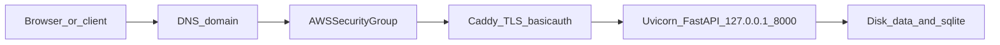

# AWS VM deployment: concepts and a practical path for VidSense

## What “deploy on a VM” actually means

You are renting a **Linux server in AWS** (most commonly **EC2**). That server has:

- A **public IP** (or you attach an **Elastic IP** so the address stays stable).
- **Disk** where you install Python, clone the repo, store SQLite under `data/`, and keep `.env`.
- **CPU/RAM** to run **Uvicorn** (your FastAPI app) and a **reverse proxy** (Caddy from [deploy/Caddyfile](deploy/Caddyfile)) that terminates **HTTPS** and forwards to `127.0.0.1:8000`.

Nothing magical happens inside AWS for your Python app: you SSH in and operate it like any other Linux box—install dependencies, run **systemd** ([deploy/vidsense.service](deploy/vidsense.service)), configure the proxy, open the right ports in a **security group** (firewall).

## How this relates to VidSense (already in the repo)

Your app is intentionally **not** bound to `0.0.0.0` in production-style runs: Uvicorn listens on **localhost**; **only Caddy** listens on **443** (and **80** for Let’s Encrypt). That matches [docs/deployment.md](docs/deployment.md).

**Secrets and config:** The VM needs a real `.env` (never commit it): `APP_SECRET_KEY`, `APP_ALLOWED_HOSTS`, `APP_DEBUG=false`, LLM keys, `DATABASE_URL`, etc.—same as local, but production values.

**Persistence:** SQLite and embeddings live under `data/`. If the EC2 instance is replaced without backup, **you lose that data** unless you snapshot/backup the volume or use external storage later.

## AWS building blocks you will use (minimal set)

| Piece                     | Role                                                                                                                                      |
| ------------------------- | ----------------------------------------------------------------------------------------------------------------------------------------- |
| **EC2 instance**          | The VM (e.g. Ubuntu LTS, small instance type to start).                                                                                   |
| **VPC + subnet**          | Default VPC is fine to start; you pick a **public subnet** if you want a public IP.                                                       |
| **Security group**        | Firewall: typically **22** from *your* IP only, **80** and **443** from `0.0.0.0/0`, **8000 closed** to the world.                        |
| **Key pair**              | SSH login (`.pem`); disable password auth on the server.                                                                                  |
| **Elastic IP (optional)** | Stable public IP if you do not use a load balancer.                                                                                       |
| **DNS**                   | A record pointing your domain to the instance (Route 53 or any registrar). Caddy uses the hostname for **automatic TLS** (Let’s Encrypt). |

**Alternatives (for context only):** **Lightsail** is a simplified EC2-like product; **Elastic Beanstalk** / **ECS** / **EKS** add more automation or containers—you do not need them for a single-VM Caddy + systemd setup.

## End-to-end flow (first successful deploy)

1. **Create the VM** — Launch EC2 (Ubuntu), attach security group rules above, use your SSH key.
2. **SSH and harden basics** — `apt update`, create non-root deploy user if desired, **UFW** or rely on security groups (many teams use SG only), ensure **only key-based SSH**.
3. **Install runtime stack** — Python 3.12+ (or use **uv** as in [README.md](README.md)), git, and **Caddy** (official install instructions for Ubuntu).
4. **Deploy code** — Clone repo to e.g. `/opt/vidsense`, `uv sync` (or `python -m venv` + pip), copy `.env` with production values, `chmod 600 .env`, ensure `data/` owned by service user.
5. **systemd** — Install unit from [deploy/vidsense.service](deploy/vidsense.service), `systemctl enable --now vidsense`, check `journalctl -u vidsense`.
6. **Caddy** — Install your edited Caddyfile (domain, `basicauth`, reverse_proxy to `127.0.0.1:8000`), `systemctl reload caddy` or equivalent.
7. **DNS** — Point `YOUR_DOMAIN` to the instance public IP; wait for propagation; confirm HTTPS works.
8. **Smoke test** — Open site in browser, exercise main flows; confirm **8000** is not reachable from the internet.

## Operational reality (what “running in prod” implies)

- **Updates:** `git pull` (or redeploy artifact), `uv sync`, restart `vidsense` service; watch for migrations/schema changes if you add them later.
- **Backups:** Regular snapshot of EBS volume or scripted copy of `data/`—especially SQLite and FAISS files.
- **Observability:** `journalctl` for app logs; consider CloudWatch agent later if you outgrow SSH log tailing.
- **Cost control:** Stop instance when experimenting; right-size instance type; beware egress if the app streams large downloads.
- **Secrets hygiene:** Prefer not to paste API keys in shell history; optional improvement is **SSM Parameter Store** / **Secrets Manager** and a small boot script to write `.env` (not required for v1).

## Suggested documentation follow-up in-repo (optional)

Your [docs/deployment.md](docs/deployment.md) is provider-agnostic. A natural next doc is `**docs/deployment-aws.md`** with: EC2 launch settings, example security group rules, Elastic IP + Route 53 A record, and Caddy/systemd paths on Ubuntu—**without** duplicating the full generic checklist.

## What you do *not* need for v1

- Kubernetes, Terraform, or CI/CD (can add later).
- RDS unless you outgrow SQLite on a single box.
- Application Load Balancer unless you need HA or multiple instances.

## Outstanding v1 trade-offs

- **Rate limiting is still deferred.** Stock Caddy does not ship built-in rate limiting, so v1 relies on Basic Auth, security groups, request-size limits, and upstream timeouts. Add a Caddy plugin or fronting service later if you start seeing abusive traffic.
- **The CSP is intentionally basic/permissive.** The current frontend uses inline scripts and third-party CDNs, so the policy must allow `'unsafe-inline'` and external `https:` sources for now. Tightening CSP further is follow-up work that likely requires moving inline JS out of templates.
- **Host-header enforcement now depends on `APP_ALLOWED_HOSTS`.** Before exposing the VM publicly, set it to include the real domain plus localhost values used for local/admin access.
- **The bootstrap script assumes the main public repo by default.** If deploying from a fork or private clone URL, pass `--repo` explicitly when running the script.

