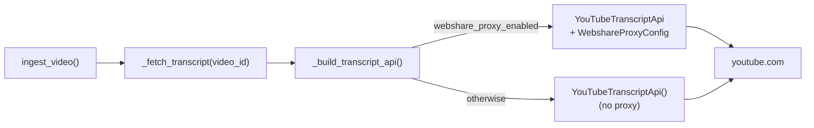

# Fix YouTube IP Block on Cloud VM

## Root cause recap

Two YouTube surfaces are in use in [app/services/youtube.py](app/services/youtube.py):

- `googleapis.com/youtube/v3` (authenticated, API key) — works fine from any IP.
- `youtube.com` innertube via `YouTubeTranscriptApi` (unauthenticated) — YouTube blocks entire cloud-datacenter IP ranges. This is what fails on your VM. The same block will hit prod.

Subsystem health is narrow: the metadata, comments, caching, and language-ranking subsystems are not themselves broken and need no changes. But end-to-end ingestion is not "mostly working" — `ingest_video` in [app/services/youtube.py](app/services/youtube.py) treats transcript retrieval as a hard required step, so on a blocked VM the whole ingestion pipeline fails. Fixing the transcript egress path restores end-to-end ingestion.

## Approach

Add a thin **transcript-api builder** seam inside `app/services/youtube.py` and derive behavior purely from whether Webshare credentials are configured:

- **Direct path** (default, current behavior, no creds set) — `YouTubeTranscriptApi()` with no proxy. Keeps local dev zero-config.
- **Webshare path** (both `WEBSHARE_PROXY_USERNAME` and `WEBSHARE_PROXY_PASSWORD` set) — `YouTubeTranscriptApi(proxy_config=WebshareProxyConfig(...))`. This is the library's officially supported proxy integration.

There is intentionally **no explicit provider flag** in this plan. A generic `http_proxy` or ASR option is trivial to add later (one extra class + one extra boolean), and that is the right moment to introduce an explicit flag — not now.



The existing 4-tier language ranking and error-to-`IngestionError` mapping stay inside `_fetch_transcript`; only the call that produces `transcript_list` moves behind the provider.

## Changes

### 1. Dependency — no new package needed

`youtube-transcript-api>=1.2.4` already bundles `WebshareProxyConfig` and `GenericProxyConfig`. Verified in [pyproject.toml](pyproject.toml). No additions.

### 2. Config — two new optional env vars

The contract is deliberately simple: **the provider is `webshare` if and only if both Webshare credentials are set; otherwise it's `direct`.** No separate flag, no auto-upgrade, no three-way validation. This matches the project's stated "simpler contract" preference and can still evolve later (e.g., when a third provider is added, that is the right time to introduce an explicit flag).

In [app/config.py](app/config.py), add to `Settings`:

```python
webshare_proxy_username: str = Field(default="", description="Webshare proxy username. If set together with webshare_proxy_password, transcript fetches route through Webshare residential proxies.")
webshare_proxy_password: str = Field(default="", description="Webshare proxy password. See webshare_proxy_username.")
```

And a computed property:

```python
@computed_field
@property
def webshare_proxy_enabled(self) -> bool:
    return bool(self.webshare_proxy_username and self.webshare_proxy_password)
```

Add one `model_validator(mode="after")` check: if **exactly one** of the two Webshare vars is set, raise a clear startup error. This follows the same fail-fast principle as the existing startup guards in [main.py](main.py) for `APP_SECRET_KEY` and `YOUTUBE_API_KEY`, but it happens even earlier at settings-load time. Both set or neither set are the only valid states. This catches the most common misconfiguration (operator pastes the username but forgets the password, or vice versa) immediately at boot instead of silently falling back to `direct` and hitting the IP-block at request time.

No other new env vars. `domain_name`, `proxy_port`, `filter_ip_locations`, `retries_when_blocked` are intentionally not exposed — `WebshareProxyConfig` defaults are correct for this use case, and exposing them now would add surface area without adding value. Documented as "knobs that exist but are not wired" in the deployment doc.

### 3. Provider seam in [app/services/youtube.py](app/services/youtube.py)

Add (near the top of the transcript section):

```python
from youtube_transcript_api.proxies import WebshareProxyConfig

def _build_transcript_api() -> YouTubeTranscriptApi:
    """Return a YouTubeTranscriptApi, routed through Webshare if credentials are configured."""
    if settings.webshare_proxy_enabled:
        return YouTubeTranscriptApi(
            proxy_config=WebshareProxyConfig(
                proxy_username=settings.webshare_proxy_username,
                proxy_password=settings.webshare_proxy_password,
            )
        )
    return YouTubeTranscriptApi()
```

In `_fetch_transcript`, replace the single line:

```python
transcript_list = YouTubeTranscriptApi().list(video_id)
```

with:

```python
transcript_list = _build_transcript_api().list(video_id)
```

The 4-tier ranking and `_to_segments` logic are unchanged. The surrounding `try`/`except` structure is restructured as described in Section 5 so typed IP-block exceptions from any network phase (including `transcript.fetch()`) are mapped consistently.

### 4. Async offload — stop blocking the event loop (GitHub issue #24)

`youtube-transcript-api` is a synchronous library built on `requests`. Today `_fetch_transcript` is a plain `def` and is called directly from the async `ingest_video`, so every transcript fetch blocks the FastAPI event loop for its entire duration. That is already a bottleneck on the direct path; it becomes materially worse after this plan lands because:

- Webshare adds a proxy hop (extra network RTT) per request.
- `WebshareProxyConfig.retries_when_blocked` defaults to **10** — a single blocked fetch can now hold the event loop for tens of seconds while the library retries internally.
- `_to_segments` inside `_fetch_transcript` calls `transcript.fetch()`, which is another blocking HTTP call per transcript. Offloading the whole `_fetch_transcript` covers it for free.

Fix: keep `_fetch_transcript` synchronous (the library is sync, and keeping it sync keeps the existing tests unchanged), and wrap only at the async call site in `ingest_video`.

Add the import at the top of [app/services/youtube.py](app/services/youtube.py):

```python
import asyncio
```

Change the call site in `ingest_video` from:

```python
transcript_result = _fetch_transcript(video_id)
```

to:

```python
transcript_result = await asyncio.to_thread(_fetch_transcript, video_id)
```

That is the entire code change for the offload. No interface change, no provider-protocol churn, and no existing test needs to be rewritten — new tests are additive, per Section 7. Providers stay sync because the underlying library is sync — if a future natively-async provider (e.g., an HTTP-based third-party vendor) is added later, it can expose its own async entry point and the caller picks the right one.

Once this ships, close GitHub issue #24 with a reference to the commit.

### 5. Error taxonomy — make IP-block failures actionable

`youtube_transcript_api` exports `RequestBlocked` and `IpBlocked` as public typed exceptions (both raised when YouTube blocks the source IP). Catch them explicitly rather than string-matching exception messages — string matching is brittle across library versions and localized messages.

Update the imports at the top of [app/services/youtube.py](app/services/youtube.py):

```python
from youtube_transcript_api import (
    IpBlocked,
    NoTranscriptFound,
    RequestBlocked,
    TranscriptsDisabled,
    YouTubeTranscriptApi,
)
```

In `_fetch_transcript`, make the typed exception mapping cover the **entire transcript retrieval flow**, not just `YouTubeTranscriptApi().list(video_id)`. That matters because `transcript.fetch()` inside `_to_segments(...)` is another blocking network call and can fail with the same IP-block / transport exceptions. The plan should therefore keep `_fetch_transcript` wrapped in one outer `try` that covers:

- `YouTubeTranscriptApi().list(video_id)`
- the tier selection logic
- every `transcript.fetch()` call inside `_to_segments(...)`

Keep the inner `try / except NoTranscriptFound: pass` handlers around each tier in place — those are tier-selection control flow (i.e., "try the next tier"), not error reporting, and collapsing them into the outer `try` would change behavior.

Add a dedicated `except (RequestBlocked, IpBlocked)` clause **before** the generic `except Exception`, alongside the existing handling for `TranscriptsDisabled` and `VideoUnavailable`:

```python
except (RequestBlocked, IpBlocked) as exc:
    return IngestionError(
        error_code="TRANSCRIPT_IP_BLOCKED",
        message=(
            "YouTube is blocking transcript requests from this server's IP. "
            "This typically happens on cloud VMs. Configure a residential proxy "
            "via WEBSHARE_PROXY_USERNAME / WEBSHARE_PROXY_PASSWORD."
        ),
        recoverable=True,
    )
```

The existing generic `except Exception` continues to handle everything else with `TRANSCRIPT_FETCH_FAILED`. This turns the current cryptic 20-line error into a clear, actionable signal in logs and API responses, with no fragile substring matching, and it ensures late failures during `transcript.fetch()` do not leak past `_fetch_transcript` untyped.

### 6. UI wiring — surface the new error code

`app/templates/partials/error.html` has a fixed `error_configs` map; unknown error codes fall back to a generic "Something Went Wrong" title with no hint. Add a new entry so the new error code has a proper title, hint, and icon:

```jinja
'TRANSCRIPT_IP_BLOCKED': {
  'icon': 'ban',
  'title': 'Transcript Temporarily Unavailable',
  'hint': 'YouTube is blocking transcript requests from this server. The operator has been notified; please try again later.',
  'color': 'amber',
  'recoverable': true,
},
```

`recoverable: true` gives the user a retry button (useful if the operator has just provisioned the proxy). The hint is end-user-facing, not operator-facing; the operator-facing details are in the server logs and the `message` field of the API response.

### 7. Tests in [tests/test_youtube.py](tests/test_youtube.py)

- Unit test `_build_transcript_api()`: with no Webshare creds (`webshare_proxy_enabled` false) returns a vanilla `YouTubeTranscriptApi`; with both Webshare creds set returns one whose `proxy_config` is a `WebshareProxyConfig` carrying the expected username/password.
- Unit test the settings validator: exactly-one-of-two Webshare vars set raises; both set or neither set validate cleanly. Be explicit about test technique here: because [app/config.py](app/config.py) creates `settings = Settings()` at import time, config-focused tests should instantiate `Settings(...)` directly (or reload the module intentionally), not rely on mutating env vars after import and hoping the singleton updates.
- Unit test the IP-block error mapping in **both** network phases:
  - patch `YouTubeTranscriptApi.list` to raise `RequestBlocked` (and separately `IpBlocked`) and assert `_fetch_transcript` returns `IngestionError(error_code="TRANSCRIPT_IP_BLOCKED", recoverable=True)`;
  - patch a selected transcript object's `fetch()` to raise `RequestBlocked` and assert it maps to the same `TRANSCRIPT_IP_BLOCKED` error instead of escaping.
- Unit test the generic late-failure path too: patch `transcript.fetch()` to raise a non-blocking exception and assert `_fetch_transcript` returns `TRANSCRIPT_FETCH_FAILED` rather than crashing out of the service.
- Unit test the `to_thread` offload: in `ingest_video`, patch `asyncio.to_thread` to an `AsyncMock` and assert it is awaited exactly once with `_fetch_transcript` as the first positional arg and `video_id` as the second, confirming the blocking call doesn't run on the event loop. For service-level tests, monkeypatch `app.services.youtube.settings` directly rather than relying on env changes to mutate the already-imported singleton.

All tests use monkeypatching only — no network calls.

### 8. Documentation

Add a self-contained "Transcript fetching on cloud VMs" section to [docs/deployment.md](docs/deployment.md) covering:

**Why it's needed** — one paragraph: YouTube blocks transcript requests from cloud-datacenter IPs (AWS, GCP, Azure, DO, Hetzner, etc.). The fix is to route transcript requests through a residential proxy. Not required for local dev.

**Which Webshare plan to buy — this is the common mistake.** `WebshareProxyConfig` is built for Webshare's **Residential** (rotating) proxy product. The free tier and the "Proxy Server" / "Static Residential" plans use datacenter IPs and will still be blocked by YouTube. Pricing starts around $3–6/month for the smallest residential tier. Signup at [webshare.io](https://www.webshare.io/).

**Where to find the credentials.** In the Webshare dashboard, navigate to the **Proxy → Proxy Settings** (or **Residential → Settings**) page. Webshare issues a dedicated **Proxy Username** and **Proxy Password** per subaccount — these are *not* your Webshare login email and password. Copy both values verbatim.

**What to put in `.env`.** Exactly two variables; do not set any others:

```bash
WEBSHARE_PROXY_USERNAME=<from Webshare dashboard>
WEBSHARE_PROXY_PASSWORD=<from Webshare dashboard>
```

Endpoint defaults (`p.webshare.io:80`, rotation enabled) are applied automatically by `WebshareProxyConfig`. Do not override `domain_name` or `proxy_port` — doing so can silently route traffic through the wrong Webshare product.

**Optional tuning (not in this plan, but documented so operators know the knobs exist).** If you later want to constrain exit countries (some YouTube videos are geo-restricted) or tune retries, `WebshareProxyConfig` also accepts `filter_ip_locations=["US", "CA", "GB"]` and `retries_when_blocked=N` (default 10). Adding these is a one-line change and intentionally not implemented yet.

**How to verify before restart.** From the VM, confirm the proxy works independently of the app. Use shell vars or literal placeholders for the test command; do not assume they already exist in the shell just because they will later live in `.env`:

```bash
export WEBSHARE_PROXY_USERNAME='<from Webshare dashboard>'
export WEBSHARE_PROXY_PASSWORD='<from Webshare dashboard>'
curl --proxy-user "${WEBSHARE_PROXY_USERNAME}-rotate:${WEBSHARE_PROXY_PASSWORD}" \
  -x http://p.webshare.io:80 \
  https://api.ipify.org
```

A successful response prints a residential-looking IP that is *not* the VM's own IP. If `curl` hangs, returns a 407, or prints the VM's IP, the credentials or plan type are wrong — fix that before restarting the service. `--proxy-user` is preferred over embedding credentials directly in the proxy URL because it is less brittle if the password contains URL-special characters.

Mirror the two env-var lines and a one-sentence pointer to this doc in [`.env.example`](.env.example) so VM operators see them when they copy the file.

## Deliberately NOT in this plan (discuss if you want them in)

- **Whisper / Gemini audio ASR fallback.** The provider seam is designed so this slots in as a new provider or a post-fail fallback, but it's a meaningful addition (cost, code, audio download which itself needs a proxy) — deserves its own plan.
- **User-pasted transcript UX fallback.** UI work, scope-expanding.
- **Generic HTTP proxy provider.** Same interface, trivial to add later; skipping unless you want it now for a self-hosted tunnel (Pi/Tailscale/Cloudflare Tunnel).
- **Third-party transcript-API vendors** (SearchAPI, Supadata, etc.). Possible as another provider, but Webshare is cheaper, library-native, and has one less vendor in the critical path.

## Rollout

1. Merge changes. With no Webshare credentials set, `webshare_proxy_enabled` is `False` and behavior is identical to today, so local dev and tests keep passing unchanged.
2. **Sign up at [webshare.io](https://www.webshare.io/)** and buy the smallest **Residential** (rotating) plan — ~$3–6/mo. **Do not use the free tier or "Proxy Server" plan**: those are datacenter IPs and YouTube still blocks them. `WebshareProxyConfig` in `youtube-transcript-api` is built for the Residential product specifically.
3. In the Webshare dashboard, open **Proxy → Proxy Settings** and copy the dashboard-issued **Proxy Username** and **Proxy Password** (not your Webshare login email/password).
4. From the VM, verify the proxy works before touching the app:

   ```bash
   export WEBSHARE_PROXY_USERNAME='<from Webshare dashboard>'
   export WEBSHARE_PROXY_PASSWORD='<from Webshare dashboard>'
   curl --proxy-user "${WEBSHARE_PROXY_USERNAME}-rotate:${WEBSHARE_PROXY_PASSWORD}" \
     -x http://p.webshare.io:80 \
     https://api.ipify.org
   ```

   A residential-looking IP that is not the VM's own IP confirms the credentials and plan type are correct.
5. Get the two vars onto the dev VM. `.env` lives only on the VM (`/opt/vidsense/.env`) — it is not shipped by [deploy/update.sh](deploy/update.sh) or [.github/workflows/deploy.yml](.github/workflows/deploy.yml), which only `git pull` + `uv sync` + `systemctl restart`. So:
   - SSH to the VM and append the two lines to `/opt/vidsense/.env` as the `vidsense` service user so ownership stays correct:

     ```bash
     ssh <admin>@<dev-vm>
     sudo -u vidsense tee -a /opt/vidsense/.env >/dev/null <<'EOF'
     WEBSHARE_PROXY_USERNAME=<from Webshare dashboard>
     WEBSHARE_PROXY_PASSWORD=<from Webshare dashboard>
     EOF
     sudo chmod 600 /opt/vidsense/.env
     ```

   - If `/opt/vidsense/.env` already has old `WEBSHARE_PROXY_*` lines, edit/replace them rather than blindly appending duplicates.
   - Leave `domain_name`, `proxy_port`, and location filters unset — the `WebshareProxyConfig` defaults are correct.
6. Restart the service to pick up the new env vars. Either path works:
   - **On the VM:** `sudo -u vidsense bash /opt/vidsense/deploy/update.sh main` (re-runs the normal deploy flow and its HTTP health probe). The startup `model_validator` only catches the **half-configured** case (exactly one of `WEBSHARE_PROXY_USERNAME` / `WEBSHARE_PROXY_PASSWORD` set); a wrong-but-complete credential (both set, one incorrect) will boot cleanly and only surface at request time as `TRANSCRIPT_IP_BLOCKED`. The step-4 `curl --proxy-user ...` smoke test is what catches the wrong-but-complete case *before* restarting the service.
   - **From GitHub:** Actions → **Deploy** → **Run workflow** (`environment=dev`, `branch=main`), or `gh workflow run deploy.yml -f environment=dev -f branch=main`.

   Either way, once `update.sh`'s health probe reports "serving", `webshare_proxy_enabled` is `True` in the live process. Verify by retrying the previously failing video; logs should no longer show `TRANSCRIPT_IP_BLOCKED`, and `sudo journalctl -u vidsense -n 50` should show a successful ingestion.
7. Rollback, if Webshare itself goes bad: SSH back in, remove the two lines from `/opt/vidsense/.env` (or comment them out), and re-run `deploy/update.sh`. With both vars unset, `webshare_proxy_enabled` is `False` and the service reverts to the direct path (same behavior as today). The IP-block error code will come back for users until the proxy is restored, which is the correct failure mode.