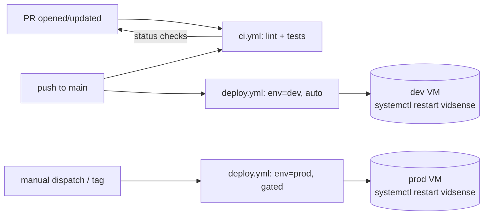
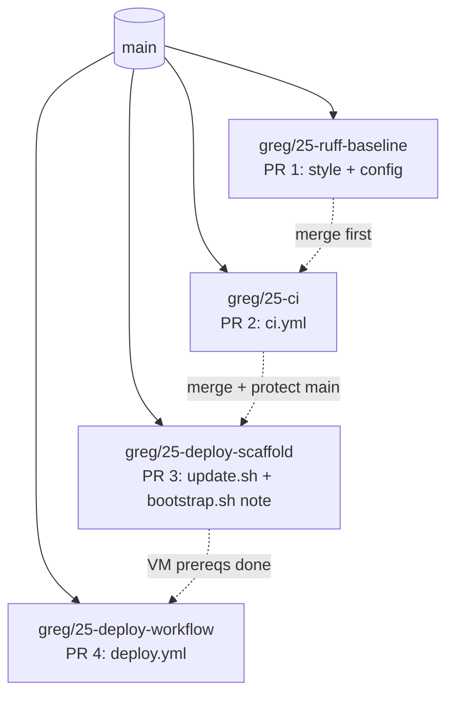

# GitHub CI/CD for VidSense

## Goals

1. Every PR to `main` (and every push updating that PR) runs **lint + unit tests** automatically and reports status on the PR.
2. The same machinery is reusable from a future **deploy workflow** (dev and prod VMs), so we don't rebuild CI later.
3. Keep it simple and close to how the repo already works: `uv`, pytest, systemd-managed VM.

## Design at a glance



Key choices:

- **Ruff** for lint + format check (single fast tool, zero extra deps at runtime; room to add mypy later as an extra job).
- **`astral-sh/setup-uv@v5`** for uv + Python version from `.python-version`, with cache keyed on `uv.lock`.
- **One reusable CI job** (`ci.yml`) callable both from PR triggers and before deploy, so we never deploy a red build.
- **Deploy over SSH** (git pull + `uv sync` + `systemctl restart vidsense`) — mirrors [deploy/bootstrap.sh](deploy/bootstrap.sh) exactly, so dev/prod stay identical in shape. Deferred implementation, but scaffolded now.
- **GitHub Environments** (`dev`, `prod`) to hold per-env secrets (SSH key, host, deploy path) and apply required reviewers on prod.

## Execution coordination

### Working branch

All work lands on the existing branch **`greg/25-add-ai`** (created for issue [#25](https://github.com/grigory93/vidsense/issues/25)). Multiple PRs will be opened against `main` over the course of execution. `greg/25-add-ai` may be reused sequentially (after each PR merges, rebase/reset onto `main` and keep going) or short-lived child branches (e.g. `greg/25-ci`, `greg/25-deploy-scaffold`) can be created off `main` when two independent changes need to be in review at the same time. The issue closes when the final PR merges, via `Fixes #25` in the last PR's body.

### PR slicing

The phases split into the PRs below. Ordering between PR 1 and PR 2 is hard — everything else is flexible.

- **PR 1 — `style: ruff baseline`**
  - Phase 1.1 (Ruff dep + `[tool.ruff]` config in [pyproject.toml](pyproject.toml)) and Phase 1.3 (committed `ruff --fix` + `ruff format` diff in one go).
  - No CI yet. Must merge before PR 2.
- **PR 2 — `ci: add lint and test workflow`**
  - Phase 1.2 (`.github/workflows/ci.yml`).
  - After merge, wait for the first green run on `main`, then enable branch protection (Phase 1.4, manual step A3 below).
- **PR 3 — `deploy: add update.sh and sudoers note`**
  - Phase 2.3 (new `deploy/update.sh`) + Phase 2.2 note added to [deploy/bootstrap.sh](deploy/bootstrap.sh). Independent of PR 2; can land in parallel or after.
- **PR 4 — `ci: add deploy workflow (dispatch-only)`**
  - Phase 3.1 `.github/workflows/deploy.yml`, but with the `on: push: branches: [main]` trigger **omitted** — only `workflow_dispatch` initially.
  - Merges only after VM prerequisites (Group C) and environment secrets (Group D) exist, and after a manual SSH dry-run from laptop succeeds (C5).
- **PR 5 — `ci: enable auto-deploy to dev on push to main`**
  - One-line change adding `on: push: branches: [main]` back to `deploy.yml`. Includes `Fixes #25`.
  - Opens only after PR 4's dispatch-deploy has been exercised successfully end-to-end at least once (E1).

### Execution sequence with handoffs

```mermaid
flowchart TD
    PR1[PR 1: ruff baseline] --> M1{Human A1: review + merge}
    M1 --> PR2[PR 2: ci.yml]
    PR2 --> M2{Human A2: merge + wait for green run}
    M2 --> A3{Human A3: enable branch protection}
    A3 --> PR3[PR 3: update.sh + sudoers doc]
    PR3 --> M3{Human: review + merge}
    M3 --> C1{Human C1 to C4: VM setup per env}
    C1 --> B1{Human B1 B2: SSH key + secret values}
    B1 --> D1{Human D1 to D3: GitHub envs + secrets + reviewers}
    D1 --> C5{Human C5: manual SSH deploy dry-run}
    C5 --> PR4[PR 4: deploy.yml dispatch-only]
    PR4 --> M4{Human: merge}
    M4 --> E1{Human E1: trigger dispatch to dev}
    E1 --> E2{Human E2: repeat for prod, gated by required reviewers}
    E2 --> PR5[PR 5: enable push-to-main auto-deploy]
    PR5 --> M5{Human: merge; closes issue 25}
```



### Human-in-the-loop checklist

Grouped by what they block. Items in a group are independent within the group but the group as a whole is blocking for its downstream PR.

**Group A — Merges and branch protection (blocks PRs 2 onward)**

- A1. Review and merge PR 1 before PR 2 is opened.
- A2. Review and merge PR 2; wait for the first green `lint` + `test` run on `main`.
- A3. Settings → Branches → add rule for `main`: require PR before merging, require status checks `lint` and `test`, require branches up to date. (Check names only appear in the dropdown after they have run once.)

**Group B — Secret values you control (blocks PR 4)**

- B1. Generate a dedicated ed25519 SSH keypair for GitHub Actions deploy: `ssh-keygen -t ed25519 -f deploy_key -N "" -C "github-actions@vidsense"`. Decide where the private key lives outside the repo (password manager or local secure store).
- B2. For each environment, collect values: `SSH_HOST`, `SSH_USER` (typically `vidsense`), `SSH_PRIVATE_KEY` (the file from B1), `DEPLOY_BRANCH` (`main` for dev, release branch/tag for prod), optional `DEPLOY_PATH` (`/opt/vidsense`), recommended `SSH_KNOWN_HOSTS` (output of `ssh-keyscan -H <host>`).

**Group C — VM-side (blocks deploy verification for a given env)**

- C1. Provision the VM for that env; run [deploy/bootstrap.sh](deploy/bootstrap.sh) if not already done.
- C2. After PR 3 is on the VM (via `git pull`), ensure `/opt/vidsense/deploy/update.sh` is executable (`chmod +x`).
- C3. Install sudoers rule: `sudo visudo -f /etc/sudoers.d/vidsense` containing `vidsense ALL=(root) NOPASSWD: /bin/systemctl restart vidsense, /bin/systemctl status vidsense`.
- C4. Append the deploy public key (B1's `.pub`) to `~vidsense/.ssh/authorized_keys`. Ensure `~vidsense/.ssh` is `700` and the file is `600`, owned by `vidsense`.
- C5. Dry-run from your laptop with the deploy private key loaded: `ssh vidsense@<host> bash /opt/vidsense/deploy/update.sh main`. Confirm the final `systemctl status` shows `Active: active (running)`.

**Group D — GitHub-side environment config (blocks PR 4 merge)**

- D1. Create `dev` and `prod` environments (web UI, or `gh api --method PUT /repos/grigory93/vidsense/environments/dev`).
- D2. Set each environment's secrets from Group B (`gh secret set --env dev --name SSH_HOST ...` etc.).
- D3. On `prod` only, enable **Required reviewers** and add yourself (or release approvers). This is the gate that prevents accidental prod deploys.

**Group E — Go-live verification (between PR 4 and PR 5)**

- E1. Actions → Deploy → Run workflow → select `dev`. Confirm green; confirm the live app reflects the new commit.
- E2. Repeat for `prod` once prod-side Group C + D are done; verify the required-reviewer approval gate fires before the SSH step runs.
- E3. Only after E1 (and ideally E2) succeed, open PR 5 to add the `on: push: branches: [main]` auto-deploy trigger.

**Group F — Optional housekeeping (any time after Group A)**

- F1. `.github/dependabot.yml` for `pip` (uv) + `github-actions` ecosystems.
- F2. `CODEOWNERS` + `.github/pull_request_template.md`.
- F3. `/healthz` route in [main.py](main.py) + `curl -fsS https://$SSH_HOST/healthz` smoke step at the end of `deploy.yml`.
- F4. Add a `mypy` job to `ci.yml`.

### What I can drive end-to-end vs. where I stop and wait

I can do: branch/commit/push, file edits, `gh pr create`, `gh secret set` (once you provide values), `gh api` calls for environments and branch protection, local `ruff --fix`, local `uv lock`.

I stop and wait on: any SSH into a VM, any step that needs a value only you have (SSH private key, hostnames, approver identities), any merge click (so we keep a human review in the loop), and any "observe the live behavior" verification (C5, E1, E2). At each wait point I'll clearly say "waiting on human step X<n>" so handoff is unambiguous.

## Phase 1 — Lint + test CI on PRs (do now)

### 1.1 Add Ruff config to `pyproject.toml`

Append a minimal, opinionated config and add `ruff` to the `dev` group:

```toml
[dependency-groups]
dev = [
    "pytest>=9.0.2",
    "pytest-asyncio>=1.3.0",
    "ruff>=0.7.0",
]

[tool.ruff]
line-length = 100
target-version = "py312"
extend-exclude = ["data", "logs", ".venv"]

[tool.ruff.lint]
select = ["E", "F", "W", "I", "B", "UP"]  # pycodestyle, pyflakes, isort, bugbear, pyupgrade
ignore = ["E501"]  # line length handled by formatter

[tool.ruff.format]
quote-style = "double"
```

Rationale: single tool, fast, covers imports + common bugs; formatter check catches style drift without forcing a big reformat commit on day one.

### 1.2 Create `.github/workflows/ci.yml`

Runs on PRs and pushes to `main`. Uses `workflow_call` so deploy can reuse it.

```yaml
name: CI

on:
  pull_request:
    branches: [main]
  push:
    branches: [main]
  workflow_call: {}

concurrency:
  group: ci-${{ github.workflow }}-${{ github.ref }}
  cancel-in-progress: true

jobs:
  lint:
    runs-on: ubuntu-latest
    steps:
      - uses: actions/checkout@v4
      - uses: astral-sh/setup-uv@v5
        with:
          enable-cache: true
          cache-dependency-glob: "uv.lock"
      - run: uv sync --group dev --frozen
      - run: uv run ruff check .
      - run: uv run ruff format --check .

  test:
    runs-on: ubuntu-latest
    steps:
      - uses: actions/checkout@v4
      - uses: astral-sh/setup-uv@v5
        with:
          enable-cache: true
          cache-dependency-glob: "uv.lock"
      - run: uv sync --group dev --frozen
      - run: uv run pytest -q
```

Notes:

- No secrets needed: [tests/conftest.py](tests/conftest.py) already sets `APP_SECRET_KEY`, `YOUTUBE_API_KEY`, `APP_ALLOWED_HOSTS` before imports, so tests run clean on a fresh runner.
- `--frozen` ensures the lockfile is authoritative; flags drift in `uv.lock` as a CI failure.
- `concurrency` cancels superseded PR runs when new commits arrive.

### 1.3 One-time Ruff baseline

Before the workflow can pass, run locally once:

```bash
uv run ruff check --fix .
uv run ruff format .
```

Commit the result as a single "style: ruff baseline" PR so the first CI-enforced PR is not drowning in unrelated fixups.

### 1.4 Require the checks on `main`

In GitHub → Settings → Branches → add rule for `main`:

- Require PR before merging.
- Require status checks: `lint`, `test`.
- Require branches up to date.

## Phase 2 — Scaffolding for later VM deploy (stub now, wire later)

This is documented and stubbed so Phase 3 is a small, obvious change.

### 2.1 GitHub Environments

Create two environments in the repo settings: **`dev`** and **`prod`**.

Per-environment secrets (same names in each):

- `SSH_HOST` — e.g. `dev.vidsense.info`
- `SSH_USER` — usually `vidsense` (the systemd service user)
- `SSH_PRIVATE_KEY` — key authorized on that VM for `vidsense`
- `DEPLOY_BRANCH` — `main` for dev, a release tag/branch for prod
- Optional: `DEPLOY_PATH` (default `/opt/vidsense`)

On `prod`: enable **Required reviewers** so deploys need approval.

### 2.2 Service-user sudo for restart

On each VM, add a minimal sudoers rule so the deploy user can restart the service without a password:

```
vidsense ALL=(root) NOPASSWD: /bin/systemctl restart vidsense, /bin/systemctl status vidsense
```

Document this as a one-line addition to [deploy/bootstrap.sh](deploy/bootstrap.sh) in Phase 3.

### 2.3 Add a deploy entry-point script under `deploy/`

New file `deploy/update.sh` (idempotent, safe to re-run):

```bash
#!/usr/bin/env bash
set -euo pipefail
BRANCH="${1:-main}"
cd /opt/vidsense
git fetch --prune origin
git checkout "$BRANCH"
git pull --ff-only origin "$BRANCH"
uv sync --frozen
sudo /bin/systemctl restart vidsense
sudo /bin/systemctl status vidsense --no-pager | head -n 20
```

This keeps the deploy logic on the VM (versioned, reviewable) and makes the GitHub Action a thin trigger.

## Phase 3 — Deploy workflow (implement when ready)

### 3.1 `.github/workflows/deploy.yml` (sketch)

```yaml
name: Deploy

on:
  push:
    branches: [main]          # auto-deploy to dev
  workflow_dispatch:
    inputs:
      environment:
        type: choice
        options: [dev, prod]
        default: dev

jobs:
  ci:
    uses: ./.github/workflows/ci.yml   # never deploy a red build

  deploy:
    needs: ci
    runs-on: ubuntu-latest
    environment: ${{ inputs.environment || 'dev' }}
    steps:
      - uses: webfactory/ssh-agent@v0.9.0
        with:
          ssh-private-key: ${{ secrets.SSH_PRIVATE_KEY }}
      - name: Add host key
        run: ssh-keyscan -H "${{ secrets.SSH_HOST }}" >> ~/.ssh/known_hosts
      - name: Trigger update
        run: |
          ssh ${{ secrets.SSH_USER }}@${{ secrets.SSH_HOST }} \
            "bash /opt/vidsense/deploy/update.sh ${{ secrets.DEPLOY_BRANCH }}"
```

Behavior:

- Push to `main` → CI runs → auto-deploy to **dev**.
- Prod deploys are **manual only** (`workflow_dispatch` with `environment=prod`), gated by required reviewers on the `prod` environment.

### 3.2 Optional later additions (not now)

- **Smoke test step** after deploy: `curl -fsS https://$SSH_HOST/healthz` (would need a `/healthz` route in [main.py](main.py)).
- **mypy** as a third CI job.
- **Dependabot** (`.github/dependabot.yml`) for `uv`/pip and `github-actions` ecosystems.
- **CODEOWNERS** + PR template under `.github/`.

## Execution strategy

Tracking issue: [grigory93/vidsense#25](https://github.com/grigory93/vidsense/issues/25). Working branch root: `greg/25-add-ai` (already exists).

Multiple PRs, each with a child branch off `greg/25-add-ai`, opened against `main` in the order below. Each PR carries `Refs #25` in its body; the final PR uses `Fixes #25`. We keep the ordering because the first two PRs have a hard dependency (Ruff baseline must land before CI is enforced).



Why multiple PRs: each is small, independently reviewable, and the state of `main` is always deployable. `greg/25-add-ai` is the umbrella label for the effort; child branches are where code lives.

Proposed PR sequence:

- **PR 1 - `greg/25-ruff-baseline`**: `pyproject.toml` Ruff config + dev dep, plus the mechanical `ruff --fix` / `ruff format` diff. Pure style/config. No CI yet.
- **PR 2 - `greg/25-ci`**: `.github/workflows/ci.yml`. First PR to show a green `lint` + `test` check. After merge, enable branch protection on `main`.
- **PR 3 - `greg/25-deploy-scaffold`**: `deploy/update.sh` + sudoers rule note appended to `deploy/bootstrap.sh`. No workflow yet; safe to merge any time after PR 2.
- **PR 4 - `greg/25-deploy-workflow`**: `.github/workflows/deploy.yml`, wired for **dev only** (both environments created in GitHub, but the job targets `environment: dev`). Initially `workflow_dispatch` only. Push-to-main auto-deploy to dev is enabled in a tiny follow-up PR *after* a successful manual dispatch.
- **Optional follow-ups** (not blocking): mypy job, `/healthz` route + smoke test, Dependabot, CODEOWNERS, wiring `prod` into `deploy.yml` when a prod VM exists.

**Confirmed scope (from planning Q&A):**

- **VMs**: dev VM exists; no prod VM yet. Plan ships Phase 3 wired for dev. The `prod` environment is still created (so secrets/reviewers are configured) but `deploy.yml` does not target it yet; add a one-line follow-up PR when prod comes online.
- **PR cadence**: sequential. Agent opens one PR, stops, waits for merge (and, after PR 2, for branch protection to be enabled) before opening the next. Between PRs the agent reports: what landed, what the user must do, and what the next PR will contain.
- **Ruff strictness (PR 1)**: `select = ["E","F","W","I","B","UP"]` plus `ruff format --check` enforced from day one. Baseline PR will contain the full `ruff --fix` + `ruff format` diff. One-and-done; no style debates later.
- **SSH key for dev deploy**: agent generates a fresh unencrypted ed25519 keypair locally during PR 4 work (`ssh-keygen -t ed25519 -f deploy_key_dev -N ""`). Public key printed for the user to append to `~vidsense/.ssh/authorized_keys` on the dev VM; private key piped into `gh secret set --env dev SSH_PRIVATE_KEY`. Local copies deleted after. The key is VidSense-specific and least-privilege (only authorizes `vidsense` service user, only allows the two sudoer'd `systemctl` commands).

### Human-in-the-loop steps

The agent can author commits/PRs, run `gh` calls, and script infrastructure-as-code. It cannot merge PRs, touch the VMs, or invent secret values. These are the hand-offs:

**A. Merging / enabling protection** (GitHub web or approving `gh` PR merges)

1. Approve and merge **PR 1** (Ruff baseline) before PR 2 opens for review.
2. Approve and merge **PR 2** (CI). Watch the first green run on `main`.
3. Enable branch protection on `main`: Settings -> Branches -> require `lint` + `test` status checks, require PR before merging, require branches up to date. *Must be done after step 2 succeeds so the check names appear in the dropdown.*
4. Approve and merge **PR 3** and **PR 4** when ready.

**B. Secret values** (agent runs `gh secret set ...` but values come from you)

5. Generate or supply the deploy SSH keypair. Decide where the private key is stored (password manager, vault, local disk). Public key goes on the VMs (step C8).
6. Provide per-environment values for `SSH_HOST`, `SSH_USER` (usually `vidsense`), `DEPLOY_BRANCH` (e.g. `main` for dev, a tag or release branch for prod), optionally `DEPLOY_PATH`.
7. Provide pinned `SSH_KNOWN_HOSTS` for prod (`ssh-keyscan <prod-host>` from a trusted location).
8. In GitHub web: set `prod` environment required reviewers (click-only; easier than `gh api` with user IDs).

**C. VM-side setup** (only you can do these; inherently manual)

9. Ensure `dev` and `prod` VMs exist and have run `deploy/bootstrap.sh`.
10. Append the deploy public key to `~vidsense/.ssh/authorized_keys` on each VM.
11. Install the sudoers rule on each VM: `sudo visudo -f /etc/sudoers.d/vidsense` with content `vidsense ALL=(root) NOPASSWD: /bin/systemctl restart vidsense, /bin/systemctl status vidsense`.

**D. Verification gates**

12. Manual smoke from your laptop: `ssh vidsense@<dev-host> bash /opt/vidsense/deploy/update.sh main`. Confirm `systemctl status` shows `active (running)`. Only then add `on: push: branches: [main]` to `deploy.yml`.
13. First prod deploy: trigger manually via `workflow_dispatch` and approve the required-reviewer gate. Confirm the pinned `SSH_KNOWN_HOSTS` matches so no TOFU prompt.

Anything outside A-D is fully automatable.

## Risk / things to watch

1. **First CI run fails without the Ruff baseline.** Merging PR 2 before PR 1 makes the tree red (every unformatted file becomes an error) and blocks every other open PR. Mitigation: strict PR 1 → PR 2 ordering (steps A1–A2). If the baseline diff is too noisy to review, narrow `select` to `["E", "F", "I"]` first and add `B` / `UP` in a follow-up PR so the initial reformat is smaller.
2. **`uv sync --frozen` fails on lockfile drift.** Any change to [pyproject.toml](pyproject.toml) without a matching `uv lock` commit fails CI with `The lockfile at uv.lock needs to be updated`. This is intentional — it forces lockfile updates through review. Add a one-line note to [README.md](README.md) ("commit both `pyproject.toml` and `uv.lock`"), and optionally add an explicit `uv lock --check` step before `uv sync --frozen` for a clearer error message.
3. **Branch protection chicken-and-egg.** The `lint` and `test` check names only appear in Settings → Branches' status-check dropdown *after* they have run once on `main`. Enabling protection first can make the baseline PR unmergeable with no checks ever able to pass. Correct order: merge PR 1 → merge PR 2 → observe the first green run on `main` → then enable protection (A3). Additional caveat: any future rename of these job names silently disables enforcement (the rule keeps the old name "expected" forever) — job renames must be paired with a Settings → Branches update.
4. **Don't enable deploy before VM prerequisites exist.** The deploy job assumes `/opt/vidsense/deploy/update.sh`, a NOPASSWD sudoers rule, and an authorized SSH key are all on the VM. Missing pieces fail in characteristic ways: missing `update.sh` → clean fast failure; missing sudoers → job hangs on `sudo: a password is required` or fails with `no tty present`; missing authorized key → `Permission denied (publickey)`; worst case partial success where `git pull` wins but `systemctl restart` fails and the VM runs old code from new files (a silent drift bug). Mitigations: PR 4 ships with dispatch-only trigger (no auto-push), Group E exercises it manually first, and `deploy/update.sh` should exit non-zero if `systemctl status` doesn't end in `active (running)` so partial deploys become red runs.
5. **SSH host-key TOFU.** The deploy job sketch uses `ssh-keyscan -H "$SSH_HOST" >> ~/.ssh/known_hosts`, which trusts whatever answers on first contact. An MITM between the GitHub runner and your VM would be accepted silently. For prod (and ideally dev too), pin `SSH_KNOWN_HOSTS` as an environment secret — run `ssh-keyscan -H prod.host` once from a trusted network, paste the result into the secret, and in the workflow use `echo "$SSH_KNOWN_HOSTS" >> ~/.ssh/known_hosts` instead of keyscanning at job time.