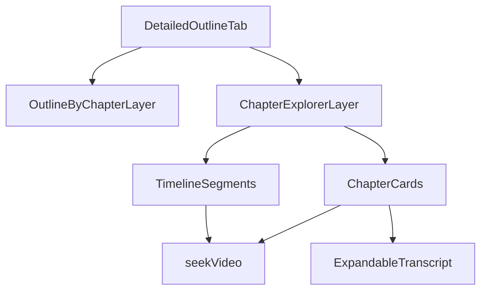

# Merge Chapters Into Detailed Outline

## Current State Analysis

- The summary depth selector and Detailed Outline content are rendered in `[app/templates/partials/results.html](app/templates/partials/results.html)` under `activeTab === 'detailed'`.
- Chapter timeline + chapter cards are currently a separate section (`#chapters-section`) in the same template, using reusable cards from `[app/templates/partials/chapter_card.html](app/templates/partials/chapter_card.html)`.
- Playback-linked behaviors (active chapter highlight, timeline segment activation, keyboard `j/k`, auto-scroll) depend on global selectors in `[static/js/player.js](static/js/player.js)` and `[static/js/app.js](static/js/app.js)`:
  - `.chapter-card`
  - `.vs-timeline-segment`
  - `#chapter-{chapter_id}`

## Optimal UI Redesign (Information Architecture)

- Keep existing three summary depth tabs/cards (Quick Take, Executive, Detailed Outline).
- Make `Detailed Outline` a **composite tab** with two stacked layers:
  1. **Outline stream with chapter separators** (new): detailed points grouped by chapter boundaries.
  2. **Chapter Explorer** (existing chapters UI migrated here): mini timeline + chapter cards + key points + expandable transcript.
- Remove the standalone Chapters block from below summaries to avoid duplication.

## Proposed Layout Inside Detailed Outline

- Top: compact “Outline by Chapter” heading with chapter count.
- For each chapter group:
  - Chapter separator row: chapter index, title, timestamp chip, duration.
  - Nested ordered list of detailed points mapped to that chapter time window/order.
- Divider.
- Existing chapter timeline bar (unchanged interaction).
- Existing chapter card list (same component and collapse/expand transcript behavior).

## Behavior Preservation Requirements

- Keep all chapter interactions exactly as-is:
  - click timestamp -> seek
  - click/keyboard timeline segment -> seek + scroll to chapter card
  - player time polling -> active chapter + active segment highlighting
  - `j/k` keyboard navigation
  - transcript expand/collapse per chapter
- Keep copy button semantics for active summary tab; when active tab is detailed, copy should include both outline text and chapter titles (or remain outline-only if preferred by product decision).

## Data/Rendering Strategy

- Reuse existing `chapters` array and `summaries.detailed.content_json` already prepared in `[app/routes/pages.py](app/routes/pages.py)`.
- Add server-side derived structure for template rendering in `partial_status`:
  - `detailed_outline_groups`: list of `{ chapter, points[] }`.
- Grouping heuristic (deterministic, no schema change required):
  - If points count equals chapter count: 1:1.
  - Else distribute by nearest proportional index across chapter count.
  - Fallback: put unmatched points into an “Additional points” group.
- This avoids immediate LLM/schema refactor and gives stable rendering now.

## File-Level Implementation Plan

1. Update `[app/routes/pages.py](app/routes/pages.py)`
  - Build and pass `detailed_outline_groups` into `partials/results.html` context.
2. Update `[app/templates/partials/results.html](app/templates/partials/results.html)`
  - Replace current flat detailed `<ol>` with grouped/chapter-separated outline.
  - Move `#chapters-section` markup into `activeTab === 'detailed'` pane below grouped outline.
  - Keep empty/partial-state fallbacks clean (outline-only, chapters-only, both missing).
3. Keep `[app/templates/partials/chapter_card.html](app/templates/partials/chapter_card.html)` unchanged
  - Preserve IDs/classes and Alpine `expanded` behavior.
4. Minimal style additions in `[static/css/app.css](static/css/app.css)`
  - New styles only for chapter separators in the outline layer.
  - No visual churn to existing chapter card/timeline styling.
5. Validate JS compatibility in `[static/js/player.js](static/js/player.js)` and `[static/js/app.js](static/js/app.js)`
  - Ensure selectors still resolve when chapters are inside hidden/shown tab content.
  - If needed, trigger a one-time `updateActiveChapter()` when switching to detailed tab.

## UX Safeguards

- Preserve clean look by using progressive disclosure:
  - outline first (scan), chapter cards second (drill-down).
- Keep spacing rhythm consistent with existing section spacing/tokens.
- Ensure mobile readability by reducing separator density and keeping chips compact.
- Maintain current loading/partial-result messaging.

## Test Plan

- Full result set: all tabs render, detailed shows grouped outline + chapter explorer.
- Summaries-only partial: detailed shows outline groups with graceful missing chapter explorer notice.
- Chapters-only partial: detailed shows chapter explorer and “outline unavailable” hint.
- Playback interactions still work (`j/k`, timeline click, active highlight, transcript toggle).
- No duplicate chapter section appears below summaries.

