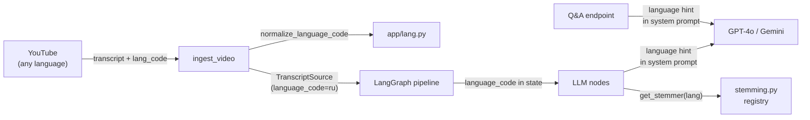

# Multi-language Support for VidSense

## Design decisions (resolved)

- **Output language = transcript language.** A Russian video produces Russian summaries, glossary, etc. JSON keys stay English.
- **Q&A is in scope.** The `/api/video/{video_id}/ask` system prompt gets a language hint too.
- **Prefer native transcript over machine-translated English.** If YouTube only has a native Russian transcript and a machine-translated English one, use the Russian original.
- `**supported_languages` is kept** as a ranked preference list, not deleted. It becomes the central contract for transcript selection order and language enablement.

---

## 0. Language normalization helper (new file)

**New file:** `app/lang.py`

A single shared module for language-code operations used across transcript selection, prompts, stemming, and persistence.

- `normalize_language_code(code: str) -> str` -- strips region suffixes, lowercases. `"pt-BR"` -> `"pt"`, `"en-US"` -> `"en"`, `None`/`""` -> `"en"`.
- `LANGUAGE_NAMES: dict[str, str]` -- ISO 639-1 to display name mapping: `en` -> `English`, `ru` -> `Russian`, `de` -> `German`, `es` -> `Spanish`, `uk` -> `Ukrainian`, `fr` -> `French`, `it` -> `Italian`, `pt` -> `Portuguese`, plus a fallback that returns the code itself.
- `language_display_name(code: str) -> str` -- looks up normalized code in `LANGUAGE_NAMES`.

All other modules import from here instead of doing ad-hoc `.split("-")[0].lower()`.

---

## 1. Transcript fetching -- deterministic ranked selection

**File:** [app/services/youtube.py](app/services/youtube.py)

Replace the current "English or error" logic in `_fetch_transcript` with a **deterministic 4-tier ranking**:

1. **Manual English** transcript (current behavior -- keep)
2. **Auto-generated English** transcript (current behavior -- keep)
3. **Manual transcript in the video's native language** -- pick the first manually created transcript from the available list, preferring languages in `settings.supported_languages` order
4. **Auto-generated transcript in the video's native language** -- same ranking as tier 3 but for generated transcripts
5. **No transcript at all** -- return `NO_TRANSCRIPT` error

The ranking is deterministic because tier 3/4 iterate `settings.supported_languages` in order, then fall through to the first remaining available language. The function continues to return `(segments, source_type, language_code)` where `language_code` is now the actual transcript language (normalized via `normalize_language_code`).

**Remove the `UNSUPPORTED_LANGUAGE` return path** in `_fetch_transcript` (lines 178-192). The tail `NO_TRANSCRIPT` error already covers "nothing available."

**Add logging:** `logger.info("Selected transcript: lang=%s, source=%s", lang_code, source_type)` after successful selection.

**File:** [app/config.py](app/config.py) line 82

**Keep `supported_languages`** but broaden its default and clarify its role:

```python
supported_languages: list[str] = Field(
    default=["en", "es", "de", "fr", "it", "pt", "ru", "uk"],
    description="Ranked language preference for transcript selection. First match wins.",
)
```

This list drives transcript preference ranking and can be overridden via env var to restrict or expand.

**File:** [app/services/youtube.py](app/services/youtube.py) -- `_detect_language`

Replace inline `.split("-")[0].lower()` with `normalize_language_code()` from `app/lang.py`.

---

## 2. Thread language through the LLM pipeline

**File:** [app/services/llm/state.py](app/services/llm/state.py)

Add `language_code: Any` to `GraphState`.

**File:** [app/services/llm/graph.py](app/services/llm/graph.py) lines 93-99

Set in `initial_state`:

```python
"language_code": normalize_language_code(transcript_source.language_code) or "en",
```

**File:** [app/services/llm/nodes.py](app/services/llm/nodes.py)

In each node (`gen_summaries_node`, `extract_chapters_node`, `extract_glossary_node`, `extract_mind_map_node`), read `state.get("language_code", "en")` and pass it to the corresponding prompt builder.

---

## 3. Update LLM prompts with language hint

**File:** [app/services/llm/prompts.py](app/services/llm/prompts.py)

Add a `language_code: str = "en"` parameter to every `build_*_messages` function. When `language_code != "en"`, append this block to the system prompt:

```
<language>
The transcript is in {language_display_name} ({language_code}).
Produce all textual output (summaries, chapter titles, key points,
definitions, etc.) in {language_display_name}.
JSON keys must remain in English.
</language>
```

Import `language_display_name` from `app/lang.py`.

When `language_code == "en"`, no hint is appended (existing behavior, avoids unnecessary prompt tokens).

---

## 4. Add language hint to Q&A

**File:** [app/routes/api.py](app/routes/api.py) lines 487-494

The Q&A system prompt currently assumes English. After this change, load the video's language and append a language hint:

```python
transcript_source = await get_transcript_for_video(video_id, session)
lang = normalize_language_code(transcript_source.language_code) if transcript_source else "en"
```

When `lang != "en"`, append to the system message:

```
The video transcript is in {language_display_name}. Answer in {language_display_name}.
```

This keeps Q&A output consistent with summaries/glossary/chapters.

---

## 5. Language-aware stemming heuristics (new file)

**New file:** `app/services/stemming.py`

**Framing:** This is a lightweight **heuristic normalization** for glossary-to-timestamp matching, not a linguistic stemming library. It improves recall for tier-3 matching but does not claim broad correctness. Tiers 1 (exact) and 2 (sliding window) remain the primary match strategies and work for any language.

Design:

- `Stemmer` class with a `suffixes: tuple[str, ...]` and `min_stem_len: int` parameter. `stem(word: str) -> str` strips the first matching suffix if the remaining stem meets `min_stem_len`.
- `_REGISTRY: dict[str, Stemmer]` mapping normalized ISO 639-1 codes to stemmers.
- `get_stemmer(language_code: str) -> Stemmer` -- normalizes the code via `normalize_language_code`, looks up the registry, returns a **no-op fallback** (`Stemmer(())`) for unknown languages.

Initial registry (suffix lists are heuristic, tested with positive *and negative* pairs):

- **English (`en`)** -- existing suffix list from `_crude_stem`
- **Spanish (`es`)** -- `cion`, `ando`, `endo`, `mente`, `idad`, `oso`, `osa`, `ble`, etc.
- **German (`de`)** -- `ung`, `keit`, `heit`, `lich`, `isch`, `bar`, `sam`, etc.
- **French (`fr`)** -- `tion`, `ment`, `eur`, `euse`, `eux`, `ique`, etc.
- **Italian (`it`)** -- `zione`, `mente`, `ando`, `endo`, `bile`, `oso`, etc.
- **Portuguese (`pt`)** -- `cao`, `mente`, `ando`, `endo`, `ade`, etc.
- **Russian (`ru`)** -- `ение`, `ость`, `ание`, `ующий`, `ивший`, etc. (Cyrillic). `min_stem_len=3` to avoid over-stripping short roots.
- **Ukrainian (`uk`)** -- `ення`, `ість`, `ання`, `ючий`, etc. (Cyrillic). Same `min_stem_len` caution.

**File:** [app/services/llm/nodes.py](app/services/llm/nodes.py) lines 440-538

Replace inline `_crude_stem` in `_find_term_occurrences` with:

```python
from app.services.stemming import get_stemmer
stemmer = get_stemmer(language_code)
```

Thread `language_code` into `_find_term_occurrences(term, segments, language_code, max_occurrences=5)` and its caller `extract_glossary_node`.

---

## 6. Frontend / error template cleanup

**Approach:** Backend and frontend change atomically in one PR. However, `UNSUPPORTED_LANGUAGE` handling is **retained as a backward-compatible fallback** (safety net) rather than deleted outright.

**File:** [app/templates/partials/error.html](app/templates/partials/error.html) lines 16-22

Reword the entry:

```
'UNSUPPORTED_LANGUAGE': {
    'icon': 'globe',
    'title': 'Language Not Available',
    'hint': 'No transcript could be found for this video in a supported language.',
    'color': 'amber',
    'recoverable': false,
},
```

**File:** [app/templates/index.html](app/templates/index.html) lines 240-256

Keep `UNSUPPORTED_LANGUAGE` in the `isContentError` list. Update its hint text to match. Remove the globe-icon `<template x-if>` special-casing (the `isContentError` amber styling already handles it).

---

## 7. Cache and migration considerations

- **Existing cached videos** with `language_code="en"` continue to work. No migration needed.
- **Re-ingesting a previously cached non-English video** that was rejected before will now succeed because `_get_cached_video` checks by `youtube_id` -- but the old row has no transcript, so transcript fetching runs fresh. This is correct behavior.
- `**force_regenerate`** remains the mechanism for users to re-analyze with updated language support. No new flag needed.

---

## 8. Tests

**File:** `tests/test_stemming.py` (new)

- Per-language positive pairs: `("algorithms", "algorithm")` for English, `("организации", "организац")` for Russian, etc.
- Per-language **negative pairs**: words that should NOT be stemmed (short words, words where suffix stripping produces a wrong root).
- `get_stemmer("xx")` returns no-op fallback; `stemmer.stem(word) == word`.
- English stemmer output matches original `_crude_stem` behavior.

**File:** `tests/test_youtube.py` (update)

- Test `_fetch_transcript` ranking with mocked `YouTubeTranscriptApi.list()` returning various transcript configurations:
  - English manual available -> picks it
  - Only Russian manual available -> picks Russian
  - Both English auto and Russian manual -> picks English auto (tier 2 beats tier 3)
  - No transcripts at all -> `NO_TRANSCRIPT`
- Test `normalize_language_code` via `app/lang.py` unit tests (could also be `tests/test_lang.py`).
- Regression: non-English video ingestion no longer returns `UNSUPPORTED_LANGUAGE`.

**File:** `tests/test_prompts.py` (new or extend existing)

- `build_summary_messages(transcript, language_code="ru")` includes `<language>` block in system prompt.
- `build_summary_messages(transcript, language_code="en")` does NOT include `<language>` block.
- Same pattern for chapter, glossary, mind-map builders.

---

## Data flow summary




