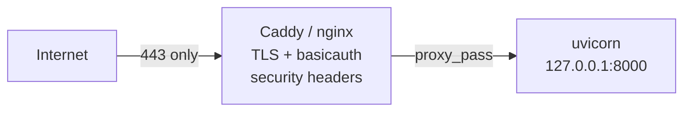

# Sensible v1 plan: secure internet-facing VidSense VM

## Context (from codebase)

- FastAPI app in [main.py](main.py); JSON API at `/api` via [app/routes/api.py](app/routes/api.py); HTML/HTMX pages via [app/routes/pages.py](app/routes/pages.py).
- **Browser `/api` constraint:** client-side `fetch()` in [app/templates/index.html](app/templates/index.html) (line 285), [app/templates/video.html](app/templates/video.html) (line 248), and [static/js/app.js](static/js/app.js) (line 374) call `/api` directly. These are same-origin calls; the default `credentials: 'same-origin'` mode means the browser **will** forward cookies and Basic Auth headers after the initial challenge. No JS changes are needed for proxy-level auth (Path A), but if the proxy ever sits on a different origin this breaks silently.
- [app/config.py](app/config.py) has `app_secret_key` with a hardcoded default `"change-me-in-production"` (line 45) -- currently unused but dangerous if later wired into session signing.
- No CORS middleware today -- default same-origin behavior is correct for single-site deployment.
- No deployment artifacts exist (no Dockerfile, Caddyfile, nginx config, systemd unit, or docker-compose).




---

## Tier 1 -- VM and edge (do first, no Python feature work)

**Ordering matters:** configure the proxy first, then switch uvicorn to localhost.

1. **TLS termination** -- Caddy (automatic Let's Encrypt) or nginx + certbot. Redirect HTTP -> HTTPS. Add HSTS header at the proxy.
2. **Reverse-proxy auth (Path A, the v1 gate)** -- Caddy `basicauth` (or nginx `auth_basic`) in front of the **entire site** (static + HTML + `/api`). One password protects everything; browser auto-sends credentials on same-origin `fetch()` after the initial challenge.
3. **Bind the app to localhost** -- Change `host="0.0.0.0"` to `"127.0.0.1"` in [main.py](main.py) line 84. Also applies when running via CLI (`uvicorn main:app --host 127.0.0.1`). **Do this after the proxy is confirmed working**, otherwise the app becomes unreachable.
4. **Security headers at the proxy** -- `X-Content-Type-Options: nosniff`, `X-Frame-Options: DENY`, `Referrer-Policy: strict-origin-when-cross-origin`, `Content-Security-Policy` (basic policy). Cheap, prevents entire classes of attacks.
5. **Proxy hardening** -- Request body size limit (e.g. 10 MB), timeouts, rate limiting (`rate_limit` in Caddy or `limit_req` in nginx).
6. **Host firewall** -- Allow **443** (and **80** for ACME redirect only). SSH: restrict source IPs, key-only auth, consider fail2ban. Do **not** expose 8000, DB, or debug ports.

---

## Tier 2 -- FastAPI production hardening (Python changes in [main.py](main.py) and [app/config.py](app/config.py))

### 2a. Disable docs when not debugging

Conditionally set `docs_url=None`, `redoc_url=None`, `openapi_url=None` on the `FastAPI(...)` constructor when `not settings.app_debug`. Prevents `/docs`, `/redoc`, `/openapi.json` from leaking the full API surface.

**Mechanics:** compute the values before the constructor since they cannot be toggled after creation:

```python
_docs = "/docs" if settings.app_debug else None
_redoc = "/redoc" if settings.app_debug else None
_openapi = "/openapi.json" if settings.app_debug else None

app = FastAPI(
    ...,
    docs_url=_docs,
    redoc_url=_redoc,
    openapi_url=_openapi,
)
```

### 2b. Sanitize validation error response

[main.py](main.py) line 51 returns `str(exc.body)` in 422 responses. In production this can echo attacker-controlled input. Change to omit `body` when `not settings.app_debug`:

```python
content = {"detail": exc.errors()}
if settings.app_debug:
    content["body"] = str(exc.body)
```

### 2c. Add ProxyHeadersMiddleware

**Required**, not optional. Without it, all requests behind the proxy show `client=127.0.0.1`, breaking audit logs and any future app-level rate limiting. Add:

```python
from uvicorn.middleware.proxy_headers import ProxyHeadersMiddleware
app.add_middleware(ProxyHeadersMiddleware, trusted_hosts=["127.0.0.1", "::1"])
```

### 2d. Add security-header middleware (defense in depth)

A small Starlette middleware or `@app.middleware("http")` that sets security headers on every response. This is a fallback in case the proxy layer is misconfigured:

- `X-Content-Type-Options: nosniff`
- `X-Frame-Options: DENY`
- `Referrer-Policy: strict-origin-when-cross-origin`

### 2e. Fix `app_secret_key` default (strict enforcement)

In [app/config.py](app/config.py), keep the default but add a startup check in the `lifespan` function in [main.py](main.py) that refuses to start if the value is still `"change-me-in-production"`. Clear error message directs the developer to set `APP_SECRET_KEY` in `.env`. This is a one-time local action.

Update [.env.example](.env.example) with explicit instructions and a generation command (`python -c "import secrets; print(secrets.token_urlsafe(32))"`).

---

## Tier 3 -- Process and file security (VM ops)

1. **Run as non-root** -- Create a dedicated `vidsense` user. Run uvicorn under that user (via systemd or supervisor).
2. **systemd unit** -- Provide a template `deploy/vidsense.service`: `User=vidsense`, `WorkingDirectory=...`, `EnvironmentFile=.../.env`, `Restart=on-failure`. Ensures the app survives reboots and crashes.
3. **File permissions** -- `.env` must be `chmod 600` (owner-only). `data/` directory owned by the service user, not world-readable (SQLite DB + FAISS embeddings contain user data).
4. **Sample Caddyfile** -- Provide `deploy/Caddyfile` with TLS, basicauth block, security headers, and reverse_proxy to `127.0.0.1:8000`. Ready to copy to the VM.

---

## Tier 2 access control -- Path A vs Path B (decision record)

### Path A -- Proxy-level auth (recommended v1)

- Caddy `basicauth` or nginx `auth_basic` in front of everything.
- **Why it works now:** same-origin `fetch()` auto-sends Basic Auth credentials; no JS changes needed.
- **Limitation:** coarse-grained (one gate), shared password, not suitable for programmatic third-party clients.
- **Evolve to:** Cloudflare Access, Authelia, OAuth2 Proxy, IP allowlists.

### Path B -- Application API key on `/api` (future, when needed)

- Add `api_access_key` / `require_api_key` to Settings; FastAPI `Depends(verify_api_key)` on the API router.
- **Significant follow-up required:** the 3 browser `fetch()` endpoints (`POST /api/analyze`, `POST /api/video/{id}/regenerate`, `POST /api/video/{id}/ask`) contain substantial inline logic (~170 lines for `/ask` alone with RAG retrieval). Moving to a BFF pattern requires extracting reusable service functions, creating server-side routes, and redirecting templates/JS. This is a feature branch, not a quick task.
- **Evolve to:** multiple keys, scopes, JWT/OIDC for user identity.

**v1 recommendation:** Path A now. Add Path B later when programmatic clients need direct API access without the proxy password.

---

## Documentation

Add a **"Production / VM Deployment"** section to README (or `docs/deploy.md`) covering:

- TLS setup and Caddyfile reference
- Bind address (`127.0.0.1`, not `0.0.0.0`)
- Firewall rules (443, SSH restrictions)
- File permissions (`.env`, `data/`)
- Non-root service user + systemd
- Path A auth setup (with note about the browser `/api` constraint and Path B as future option)
- Checklist: `APP_DEBUG=false`, `APP_SECRET_KEY` set, docs endpoints disabled

---

## Out of scope for v1 (explicit follow-ons)

- Per-user accounts, JWT/OIDC, mTLS, CSRF tokens, full WAF/DDoS, secrets manager, database network isolation, container/Docker deployment, CI/CD pipeline hardening, CORS (only needed if Path B + external clients).

