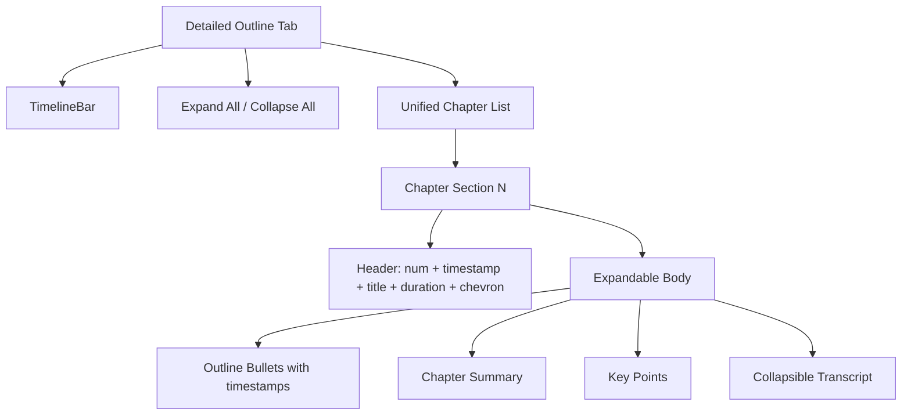

# True Merge: Detailed Outline + Chapters

## Problem

The current Detailed Outline tab has two stacked sections -- outline points grouped by chapter separators, then a complete copy of the Chapters section below a divider. This is not a merge; it's duplication. Chapter summaries, key points, and transcript only appear in the bottom section. There is also a scroll-bounce bug where chapter cards and bullet points compete for `scrollIntoView` every tick.

## Target Design

A single unified list where each chapter is one collapsible unit:

```
[Timeline bar]
[Expand All / Collapse All]

Chapter 1  [>0:00]  Introduction                    2m 30s   v
  ~0:00  First detailed outline point
  ~0:30  Second detailed outline point
  ~1:00  Third detailed outline point
  > Summary: "This chapter introduces..."
  > Key points:
    - Concise point A
    - Concise point B
  > View transcript (42 lines)

Chapter 2  [>2:30]  Main Topic                      4m 15s   v
  ...
```

**Always visible** (collapsed state): chapter header row with number, seekable timestamp, title, duration, chevron.

**Expandable per-chapter** (toggled by click or Expand All):

- Detailed outline bullet points (with `~timestamp` chips and playback tracking)
- Chapter summary paragraph
- Key points with checkmark icons
- "View transcript" toggle with expandable transcript

## Architecture




## Files to Change

### 1. `[app/templates/partials/results.html](app/templates/partials/results.html)`

The detailed tab pane (lines 171-317) gets completely rewritten:

- **Remove** PART 1 (separate grouped outline) AND PART 2 (separate chapter explorer)
- **Replace** with a single unified section:
  - Timeline bar (moved to top, before the list)
  - Expand All / Collapse All header row
  - Single `#chapter-list` with unified chapter sections
- Each chapter section is a single `<div class="chapter-card ...">` to preserve all `.chapter-card` CSS selectors for `player.js`
- Inside each chapter section's expandable body:
  1. Outline bullets `<ol>` with `.outline-point` items (existing markup preserved for playback tracking)
  2. Chapter summary `<p>` (from `group.chapter.summary`)
  3. Key points `<ul>` (from `group.chapter.key_points`)
  4. Transcript toggle (from `group.chapter.transcript_segment`)
- The Alpine `x-data` on each unified section uses `{ localExpanded: false, transcriptOpen: false }` exactly like current `chapter_card.html`, with parent `allExpanded` binding
- Keep `data-start`, `data-end`, `id="chapter-{chapter_id}"` on each section for player.js compatibility

The separate `chapter_card.html` include is no longer used within the detailed tab. The fallback (chapters-only, no summaries) at lines 327-387 can still use `chapter_card.html` as-is.

### 2. `[static/js/player.js](static/js/player.js)`

Fix the scroll-bounce bug with transition-based scrolling:

- Track `lastActiveCard` and `lastActiveBullet` across ticks
- Only call `scrollIntoView` when an element **transitions** from inactive to active (wasn't active last tick)
- When a bullet is active, **suppress** chapter-card auto-scroll (the bullet is the finer-grained target within the same visible area)
- Reset trackers when playback stops

### 3. `[app/templates/partials/chapter_card.html](app/templates/partials/chapter_card.html)`

No changes needed. It continues to be used by the fallback standalone chapters section (no-summaries case).

### 4. `[app/routes/pages.py](app/routes/pages.py)`

No changes needed. The `detailed_outline_groups` already contains `{ chapter: {..., summary, key_points, transcript_segment, ...}, points: [{text, timestamp_sec, end_timestamp_sec, ...}] }` -- all the data needed for the unified view is already being passed.

### 5. `[static/css/app.css](static/css/app.css)`

Minor additions:

- `.vs-chapter-summary` for the chapter summary paragraph inside the expandable area (subtle styling to distinguish from outline bullets)
- Reuse existing `.chapter-card`, `.chapter-card-header`, `.chapter-card-chevron`, `.is-active-chapter` classes unchanged so player.js and existing styles work

### 6. `[static/js/app.js](static/js/app.js)`

No changes needed -- `navigateChapter`, `ensureDetailedTabActive`, and timeline segment handlers all use `.chapter-card` selectors which will continue to work.

## Key Design Decisions

- The unified chapter section reuses the `.chapter-card` class and `id="chapter-{id}"` / `data-start` / `data-end` attributes. This means ALL existing player.js highlighting, app.js keyboard navigation, and CSS active states work without selector changes.
- Outline bullets keep their `.outline-point` class and `data-start`/`data-end` attributes for bullet-level playback tracking.
- The chapter header is clickable to expand/collapse (like current chapter cards), with the timestamp chip clickable to seek (with `stopPropagation`).
- "Now Playing" badge stays on the chapter header row.
- Expand All / Collapse All goes at the top of the detailed tab, next to the timeline.

## Fallback / Partial States

- **Both available**: unified merged view as described
- **Outline only, no chapters**: flat numbered list (no chapter structure) -- existing ungrouped fallback, no expand/collapse needed
- **Chapters only, no summaries**: standalone chapters section using `chapter_card.html` (the `` fallback block at end of results.html)
- **Neither**: empty state message

