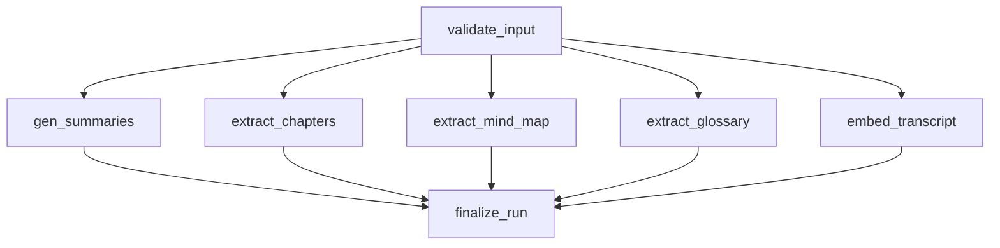

# V2 Features: Mind Maps, Contextual Glossary, Semantic Q&A

## Current Architecture (baseline)

The pipeline fans out `gen_summaries` and `extract_chapters` in parallel after `validate_input`, then fans in to `finalize_run`. Each node uses structured LLM output (`with_structured_output`) and persists to SQLite via its own async session. A single shared `llm` instance is passed via `GraphState`.

The frontend is a two-panel layout: scrollable left panel (summaries + unified detailed outline/chapters) and sticky right panel (YouTube player + metadata + regenerate form), rendered via HTMX polling + Alpine.js.

Key files:

- Pipeline: `[app/services/llm/graph.py](app/services/llm/graph.py)`, `[app/services/llm/nodes.py](app/services/llm/nodes.py)`, `[app/services/llm/state.py](app/services/llm/state.py)`, `[app/services/llm/prompts.py](app/services/llm/prompts.py)`
- LLM factory: `[app/services/llm/providers.py](app/services/llm/providers.py)` -- single `get_llm()` returning one model for all tasks
- Config: `[app/config.py](app/config.py)` -- `llm_provider` + `llm_model` (global pair)
- DB models: `[app/models/db.py](app/models/db.py)` -- Video, TranscriptSource, AnalysisRun, Summary, Chapter
- Routes: `[app/routes/pages.py](app/routes/pages.py)` (`partial_status`), `[app/routes/api.py](app/routes/api.py)`
- Templates: `[app/templates/partials/results.html](app/templates/partials/results.html)`, `[app/templates/video.html](app/templates/video.html)`

---

## Step 1: Per-Task LLM Model Configuration

### Problem

Currently a single `LLM_PROVIDER` + `LLM_MODEL` pair drives every pipeline task. Different tasks have different cost/quality/speed profiles -- chapter extraction needs strong reasoning, glossary/mind-map can use a cheaper model, Q&A benefits from a fast model, and embeddings require a dedicated model class entirely.

### Design

One global provider (all tasks share the same API key), per-task model name overrides that fall back to the global default when unset. Zero additional config required for current behavior to keep working.

#### Config changes in `[app/config.py](app/config.py)`

```python
# Existing (unchanged)
llm_provider: str = Field(default="openai")
llm_model: str = Field(default="gpt-4o-mini")

# NEW: Per-task model overrides (all optional, fall back to llm_model)
llm_model_summaries: str | None = Field(default=None, description="Model for summary generation")
llm_model_chapters: str | None = Field(default=None, description="Model for chapter extraction")
llm_model_mind_map: str | None = Field(default=None, description="Model for mind map extraction")
llm_model_glossary: str | None = Field(default=None, description="Model for glossary extraction")
llm_model_qa: str | None = Field(default=None, description="Model for Q&A answer generation")

# NEW: Embedding (separate model class -- not a chat model)
embedding_model: str = Field(default="text-embedding-3-small", description="Embedding model name")
embeddings_dir: str = Field(default="data/embeddings", description="Directory for FAISS index files")
qa_max_history: int = Field(default=10, description="Max conversation turns to include in Q&A context")
```

#### Provider factory refactor in `[app/services/llm/providers.py](app/services/llm/providers.py)`

```python
TASK_SUMMARIES = "summaries"
TASK_CHAPTERS = "chapters"
TASK_MIND_MAP = "mind_map"
TASK_GLOSSARY = "glossary"
TASK_QA = "qa"

def _resolve_model(task: str | None) -> str:
    """Return the model name for a given task, falling back to the global default."""
    if task:
        override = getattr(settings, f"llm_model_{task}", None)
        if override:
            return override
    return settings.llm_model

def get_llm(task: str | None = None) -> BaseChatModel:
    """Return a ChatModel configured for the given task."""
    model = _resolve_model(task)
    provider = settings.llm_provider.lower()
    # ... existing provider switch logic, using `model` param ...

def get_embedding_model() -> Embeddings:
    """Return an embedding model matching the global provider."""
    provider = settings.llm_provider.lower()
    if provider == "openai":
        from langchain_openai import OpenAIEmbeddings
        return OpenAIEmbeddings(model=settings.embedding_model, api_key=settings.openai_api_key or None)
    if provider == "google":
        from langchain_google_genai import GoogleGenerativeAIEmbeddings
        return GoogleGenerativeAIEmbeddings(model=settings.embedding_model, google_api_key=settings.google_api_key or None)
    if provider == "ollama":
        from langchain_openai import OpenAIEmbeddings
        return OpenAIEmbeddings(model=settings.embedding_model, base_url=f"{settings.ollama_base_url}/v1", api_key="ollama")
    if provider == "anthropic":
        raise ValueError("Anthropic does not provide an embedding API. Set LLM_PROVIDER to openai/google/ollama, or override EMBEDDING_MODEL for a supported provider.")
```

#### Node migration

Each node constructs its own LLM instead of reading from shared state. This removes `llm` from `GraphState` (nodes already use their own DB sessions -- per-node LLM is the same isolation pattern).

- `gen_summaries_node`: `llm = get_llm(task=TASK_SUMMARIES)`
- `extract_chapters_node`: `llm = get_llm(task=TASK_CHAPTERS)`
- New nodes follow the same pattern

#### `.env.example` additions

```env
# Per-task model overrides (optional -- falls back to LLM_MODEL if unset)
# LLM_MODEL_SUMMARIES=gpt-4o
# LLM_MODEL_CHAPTERS=gpt-4o
# LLM_MODEL_MIND_MAP=gpt-4o-mini
# LLM_MODEL_GLOSSARY=gpt-4o-mini
# LLM_MODEL_QA=gpt-4o-mini
EMBEDDING_MODEL=text-embedding-3-small
```

---

## Step 2: Top-Level Tab Navigation (UX)

Add a **primary navigation bar** at the top of the left panel content area that switches between four views. The right panel (player, metadata, regenerate) stays constant.

```mermaid
flowchart LR
  subgraph leftPanel [Left Panel Tabs]
    readTab["Read"]
    mapTab["Mind Map"]
    glossaryTab["Glossary"]
    askTab["Ask"]
  end
  subgraph rightPanel [Right Panel - unchanged]
    player[YouTube Player]
    meta[Video Meta]
    regen[Regenerate Form]
  end
  readTab --> summaries[Summaries + Chapters]
  mapTab --> graph[Interactive Graph]
  glossaryTab --> termList[Searchable Term List]
  askTab --> chat[Q&A Chat]
```


- **Read** (default): Current summaries + unified detailed outline/chapters experience, unchanged
- **Mind Map**: Full-width interactive concept graph with chapter cross-references
- **Glossary**: Searchable/filterable term list with timestamped video references
- **Ask**: Conversational Q&A with timestamp-cited answers

Implementation in `[app/templates/partials/results.html](app/templates/partials/results.html)`: Alpine.js `x-data="{ activeView: 'read' }"` wrapping the content area, with `x-show` for each view pane. Each tab shows a skeleton/placeholder while its data is processing and renders progressively when available.

---

## Step 3: Shared Pipeline Infrastructure

### Extended pipeline topology

All five extraction nodes fan out in parallel from `validate_input`:




Wall-clock impact is modest since all nodes run concurrently; the pipeline finishes when the slowest node completes.

### GraphState extension in `[app/services/llm/state.py](app/services/llm/state.py)`

Remove `llm` (nodes now construct their own). Add:

```python
mind_map_result: Any     # MindMapSchema | None
mind_map_error: Any      # str | None
glossary_result: Any     # GlossaryListSchema | None
glossary_error: Any      # str | None
embedding_error: Any     # str | None
```

### Graph topology update in `[app/services/llm/graph.py](app/services/llm/graph.py)`

```python
graph.add_node("extract_mind_map", extract_mind_map_node)
graph.add_node("extract_glossary", extract_glossary_node)
graph.add_node("embed_transcript", embed_transcript_node)

graph.add_edge("validate_input", "extract_mind_map")
graph.add_edge("validate_input", "extract_glossary")
graph.add_edge("validate_input", "embed_transcript")

graph.add_edge("extract_mind_map", "finalize_run")
graph.add_edge("extract_glossary", "finalize_run")
graph.add_edge("embed_transcript", "finalize_run")
```

### `finalize_run_node` update

Check for `mind_map_error`, `glossary_error`, `embedding_error` in addition to existing summary/chapter errors when deciding `complete` vs. `partial` status.

### Database migration in `[app/database.py](app/database.py)`

`CREATE TABLE IF NOT EXISTS` for `mind_maps`, `glossary_terms`, `qa_messages` at startup (same lightweight pattern used for Video column migrations).

---

## Feature 1: Mind Maps

### Complexity: Medium-High (~3-4 days)

Main complexity is the frontend visualization (interactive force-directed graph). Backend plumbing follows the exact same pattern as existing nodes.

### LLM Extraction

New Pydantic schemas in `[app/models/schemas.py](app/models/schemas.py)`:

```python
class MindMapNodeSchema(BaseModel):
    node_id: str          # e.g. "n_01"
    label: str            # display label
    type: str             # "concept" | "person" | "technology" | "event" | "theory"
    description: str      # 1-2 sentence grounded definition
    chapter_ids: list[str]  # which chapters discuss this node

class MindMapEdgeSchema(BaseModel):
    source: str           # node_id
    target: str           # node_id
    relationship: str     # e.g. "uses", "contrasts with", "builds on"

class MindMapSchema(BaseModel):
    nodes: list[MindMapNodeSchema]
    edges: list[MindMapEdgeSchema]
```

### DB Schema in `[app/models/db.py](app/models/db.py)`

```python
class MindMap(Base):
    __tablename__ = "mind_maps"
    id: Mapped[int] = mapped_column(Integer, primary_key=True)
    run_id: Mapped[int] = mapped_column(ForeignKey("analysis_runs.id"), nullable=False, index=True)
    nodes_json: Mapped[str] = mapped_column(Text, nullable=False)
    edges_json: Mapped[str] = mapped_column(Text, nullable=False)
    run: Mapped["AnalysisRun"] = relationship(back_populates="mind_map")
```

Single JSON-blob table (not normalized) -- the graph is always loaded as a unit and node/edge count is modest (10-30 nodes typical).

### Pipeline Node

New prompt template in `[app/services/llm/prompts.py](app/services/llm/prompts.py)`. New `extract_mind_map_node` in `[app/services/llm/nodes.py](app/services/llm/nodes.py)` -- follows exact pattern of `gen_summaries_node`:

```python
async def extract_mind_map_node(state: GraphState) -> dict:
    llm = get_llm(task=TASK_MIND_MAP)
    # ... invoke with structured output (MindMapSchema), persist to DB ...
```

The mind map is generated from the **full transcript** (not from summaries/chapters) so it captures concepts that aren't prominent enough for chapter titles. The `chapter_ids` cross-reference uses chapter time ranges.

### Frontend Visualization

Use **Cytoscape.js** (CDN, ~280KB gzipped) for the interactive graph:

- Force-directed (cose) layout with node clustering by type
- Nodes color-coded by type (concept=blue, person=green, technology=purple, etc.)
- Click a node to see its description and linked chapters (popover)
- Click a chapter link from a node to seek the video and switch to Read tab
- Zoom, pan, fit-to-screen controls
- Export as PNG button

Cytoscape data is passed as a JSON `<script>` block from the server. CDN added to `[app/templates/base.html](app/templates/base.html)`.

---

## Feature 2: Contextual Glossary

### Complexity: Medium (~2-3 days)

Straightforward LLM extraction + deterministic timestamp mapping using existing `segments_json`. The UI is a searchable list -- simpler than the graph visualization.

### LLM Extraction

New schema in `[app/models/schemas.py](app/models/schemas.py)`:

```python
class GlossaryTermSchema(BaseModel):
    term: str                # the term or phrase
    definition: str          # concise definition grounded in transcript context
    category: str            # "technical" | "domain" | "person" | "acronym" | "methodology"
    related_terms: list[str] # other terms in the glossary this relates to

class GlossaryListSchema(BaseModel):
    terms: list[GlossaryTermSchema]
```

### Timestamp Mapping (deterministic, post-LLM)

After the LLM extracts terms, a deterministic pass searches `TranscriptSource.segments_json` for each term's occurrences:

- Case-insensitive substring match across segments
- For each match, record `{ timestamp_sec, context_snippet }` where `context_snippet` is the segment text
- Sort occurrences by timestamp
- Mark the **first occurrence** as the "primary" reference (where the term is most likely introduced/defined)

This two-step approach (LLM for semantic extraction + deterministic for timestamp mapping) is more reliable than asking the LLM to guess timestamps. The node receives `state["transcript_source"]` which has `segments_json`.

### DB Schema in `[app/models/db.py](app/models/db.py)`

```python
class GlossaryTerm(Base):
    __tablename__ = "glossary_terms"
    id: Mapped[int] = mapped_column(Integer, primary_key=True)
    run_id: Mapped[int] = mapped_column(ForeignKey("analysis_runs.id"), nullable=False, index=True)
    term: Mapped[str] = mapped_column(String(256), nullable=False)
    definition: Mapped[str] = mapped_column(Text, nullable=False)
    category: Mapped[str] = mapped_column(String(64), nullable=False)
    related_terms_json: Mapped[str | None] = mapped_column(Text)
    occurrences_json: Mapped[str] = mapped_column(Text, nullable=False)  # [{timestamp_sec, context}]
    sort_order: Mapped[int] = mapped_column(Integer, nullable=False, default=0)
    run: Mapped["AnalysisRun"] = relationship(back_populates="glossary_terms")
```

### Frontend

- **Search bar** at top: filters terms by substring match (Alpine.js client-side filtering)
- **Category filter chips**: Technical | Domain | Person | Acronym | Methodology (toggle filtering)
- **Term cards**: each shows term, definition, category badge, and timestamp chips
- **Timestamp chips** are clickable -- `onclick="seekVideo(timestamp_sec)"` -- same pattern as chapter timestamps
- **"First mentioned at"** badge on the primary occurrence
- **Related terms**: clickable links that scroll/highlight the related term card
- Alphabetical sort by default, with option to sort by first occurrence timestamp

---

## Feature 3: Semantic Q&A

### Complexity: High (~4-5 days)

Requires embedding infrastructure, vector storage, a RAG retrieval pipeline, a new API endpoint for interactive queries, and a chat-like frontend. Most architecturally significant addition.

### New Dependencies

Add to `[pyproject.toml](pyproject.toml)`:

```toml
"langchain-text-splitters>=0.3.0",
"faiss-cpu>=1.9.0",
```

**Why FAISS over ChromaDB**: FAISS is lighter-weight (no server process, no extra database), serializes to a single file per video, and integrates cleanly with LangChain. For a single-user app with SQLite, it's the right fit. Each video gets a FAISS index stored in `data/embeddings/`, keyed by `video_id`.

### Embedding Pipeline Node

New `embed_transcript_node` in the LangGraph pipeline:

1. Load `segments_json` from `TranscriptSource`
2. Chunk into ~500-token windows with 50-token overlap (using `RecursiveCharacterTextSplitter` from `langchain-text-splitters`), preserving segment timestamps per chunk
3. Each chunk gets metadata: `{ start_time_sec, end_time_sec, chapter_id (if available) }`
4. Embed all chunks via `get_embedding_model()`
5. Build FAISS index and persist to `data/embeddings/{video_id}.faiss` + `{video_id}.pkl` (docstore)

For a 60-min video (~15k words), this is ~30-50 chunks and takes ~5-10 seconds to embed.

### Q&A API Endpoint

New endpoint in `[app/routes/api.py](app/routes/api.py)`:

```
POST /api/video/{video_id}/ask
Body: { "question": "...", "conversation_id": "..." (optional) }
Response: {
  "answer": "...",
  "citations": [
    { "text": "relevant chunk...", "start_time_sec": 120, "end_time_sec": 145, "chapter_title": "..." }
  ],
  "conversation_id": "..."
}
```

RAG flow:

1. Embed the user's question via `get_embedding_model()`
2. Retrieve top-5 similar chunks from the video's FAISS index
3. Build a prompt with the retrieved chunks as context (including timestamps)
4. `get_llm(task=TASK_QA)` generates an answer with explicit citations referencing the chunk timestamps
5. Parse citations and return structured response

### Conversation History

New table in `[app/models/db.py](app/models/db.py)`:

```python
class QAMessage(Base):
    __tablename__ = "qa_messages"
    id: Mapped[int] = mapped_column(Integer, primary_key=True)
    video_id: Mapped[int] = mapped_column(ForeignKey("videos.id"), nullable=False, index=True)
    conversation_id: Mapped[str] = mapped_column(String(64), nullable=False, index=True)
    role: Mapped[str] = mapped_column(String(16), nullable=False)  # "user" | "assistant"
    content: Mapped[str] = mapped_column(Text, nullable=False)
    citations_json: Mapped[str | None] = mapped_column(Text)
    created_at: Mapped[datetime] = mapped_column(DateTime, server_default=func.now())
```

Previous messages in the conversation are included in the RAG prompt (up to `qa_max_history` turns).

### Frontend Chat UI

Located in the "Ask" tab of the left panel:

- **Input bar** fixed at bottom of the tab: text input + send button
- **Message list** scrollable above: user messages (right-aligned bubbles) and assistant messages (left-aligned)
- **Citations** rendered as clickable timestamp chips below each assistant message (same visual as glossary/chapter timestamps)
- **"Based on"** indicator showing which transcript segments were used
- **Empty state**: suggested questions generated from the video's summaries (e.g., "What are the main arguments?", "Explain [concept from glossary]")
- Alpine.js `x-data` component with `messages` array, `fetch` for API calls, auto-scroll on new message

---

## Progressive Rendering

Extend `partial_status` in `[app/routes/pages.py](app/routes/pages.py)` to also query for mind map and glossary data during processing. Pass `has_mind_map`, `has_glossary`, `has_embeddings` boolean flags to the template so each tab can show its real content as soon as its node completes, with skeleton placeholders for still-processing tabs.

---

## File Change Summary

- `[app/config.py](app/config.py)` -- Add `llm_model_summaries/chapters/mind_map/glossary/qa` overrides, `embedding_model`, `embeddings_dir`, `qa_max_history`
- `[app/services/llm/providers.py](app/services/llm/providers.py)` -- Refactor `get_llm(task=)` with `_resolve_model()` fallback; add `get_embedding_model()` factory; add `TASK_`* constants
- `[app/models/db.py](app/models/db.py)` -- Add `MindMap`, `GlossaryTerm`, `QAMessage` models; add relationships to `AnalysisRun` and `Video`
- `[app/models/schemas.py](app/models/schemas.py)` -- Add `MindMapSchema`, `MindMapNodeSchema`, `MindMapEdgeSchema`, `GlossaryTermSchema`, `GlossaryListSchema`
- `[app/database.py](app/database.py)` -- `CREATE TABLE IF NOT EXISTS` for 3 new tables at startup
- `[app/services/llm/state.py](app/services/llm/state.py)` -- Remove `llm`; add `mind_map_result/error`, `glossary_result/error`, `embedding_error`
- `[app/services/llm/graph.py](app/services/llm/graph.py)` -- Add 3 new nodes to fan-out; remove `llm` from `initial_state`
- `[app/services/llm/nodes.py](app/services/llm/nodes.py)` -- Refactor existing nodes to `get_llm(task=...)`; add `extract_mind_map_node`, `extract_glossary_node`, `embed_transcript_node`
- `[app/services/llm/prompts.py](app/services/llm/prompts.py)` -- Add mind map and glossary system/human prompt templates
- `[app/routes/pages.py](app/routes/pages.py)` -- Pass mind map, glossary, embedding flags to templates; enrichment helpers
- `[app/routes/api.py](app/routes/api.py)` -- Add `POST /api/video/{id}/ask` endpoint with RAG flow
- `[app/templates/partials/results.html](app/templates/partials/results.html)` -- Add top-level tab bar; add Mind Map, Glossary, Ask tab panes
- `[app/templates/base.html](app/templates/base.html)` -- Add Cytoscape.js CDN
- `[static/js/app.js](static/js/app.js)` -- Tab navigation logic, glossary search, Q&A chat Alpine component
- `[static/css/app.css](static/css/app.css)` -- Styles for tab bar, graph container, glossary cards, chat UI
- `[pyproject.toml](pyproject.toml)` -- Add `langchain-text-splitters`, `faiss-cpu`
- `[.env.example](.env.example)` -- Add all `LLM_MODEL_`* per-task vars, `EMBEDDING_MODEL`, `EMBEDDINGS_DIR`

---

## Recommended Implementation Order

1. **Per-task LLM config** (0.5 day) -- foundational: refactor `config.py` + `providers.py`, update existing nodes to `get_llm(task=...)`, update `.env.example`
2. **Shared pipeline infra + tab navigation** (1 day) -- GraphState extension, graph topology, DB migration, tab bar UI shell
3. **Glossary** (2-3 days) -- simplest feature, establishes the pattern for new pipeline nodes, validates the tab UX
4. **Mind Map** (3-4 days) -- medium complexity, Cytoscape.js graph visualization is the main challenge
5. **Semantic Q&A** (4-5 days) -- most complex, requires embedding infra + RAG pipeline + chat UI

Total estimate: ~11-14 days of focused work.