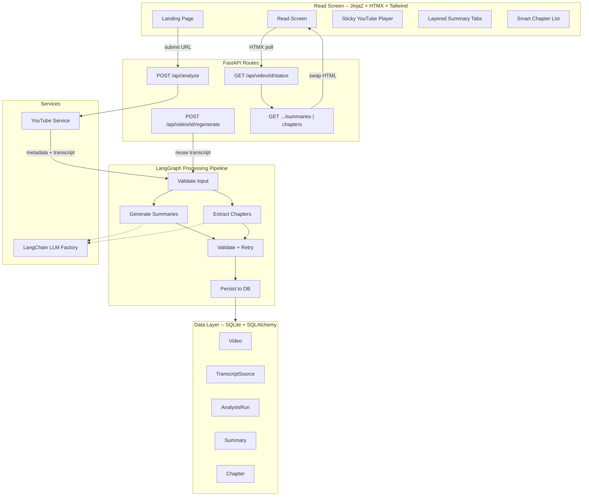
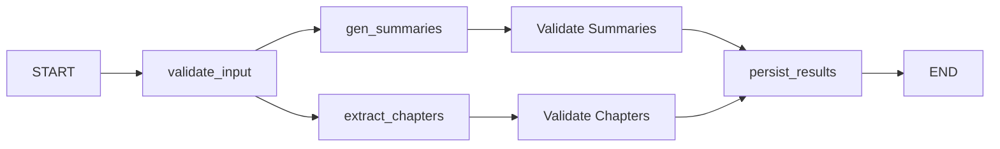

# VidSense "Read" Module V1 MVP -- Implementation Plan

## Architecture Overview




## Tech Stack (Confirmed)

- **Web framework:** FastAPI with Jinja2 templates
- **Frontend interactivity:** HTMX (partial swaps, polling), Alpine.js (minor UI state), Tailwind CSS (styling)
- **LLM orchestration:** LangChain + LangGraph (pluggable LLMs: OpenAI, Gemini, Anthropic, Ollama)
- **Database:** SQLite via SQLAlchemy (async with aiosqlite)
- **YouTube ingestion:** youtube-transcript-api, yt-dlp
- **Video player:** YouTube IFrame API
- **Validation:** Pydantic v2 for both API schemas and LLM output parsing

## Project Structure

```
vidsense/
├── main.py                          # FastAPI app, lifespan, mount statics/templates
├── pyproject.toml                   # Dependencies managed via uv
├── .env.example                     # LLM API keys, model config, DB path
├── app/
│   ├── __init__.py
│   ├── config.py                    # pydantic-settings: Settings class
│   ├── database.py                  # SQLAlchemy async engine, session factory, init_db
│   ├── models/
│   │   ├── db.py                    # ORM: Video, TranscriptSource, AnalysisRun, Summary, Chapter
│   │   └── schemas.py              # Pydantic: ChapterSchema, SummarySchema, AnalysisStatus
│   ├── services/
│   │   ├── youtube.py              # URL validation, metadata (yt-dlp), transcript (youtube-transcript-api)
│   │   ├── processing.py           # Top-level orchestration (invoke LangGraph, handle partial failure)
│   │   └── llm/
│   │       ├── providers.py        # LangChain ChatModel factory (pluggable by env)
│   │       ├── prompts.py          # Prompt templates: summaries, chapters, with/without focus
│   │       ├── graph.py            # LangGraph StateGraph definition
│   │       └── nodes.py            # Graph nodes: validate, gen_summaries, extract_chapters, persist
│   ├── routes/
│   │   ├── pages.py                # GET / (landing), GET /video/{id} (read screen)
│   │   └── api.py                  # POST /api/analyze, GET /api/video/{id}/status, POST /api/video/{id}/regenerate
│   └── templates/
│       ├── base.html               # Tailwind CDN, HTMX CDN, Alpine.js CDN, nav, layout shell
│       ├── index.html              # URL input + optional focus prompt form
│       ├── video.html              # Read screen: player + summary tabs + chapter list
│       └── partials/
│           ├── processing.html     # Spinner/progress state (HTMX polling target)
│           ├── summaries.html      # 3-level summary tabs
│           ├── chapters.html       # Chapter card list
│           ├── chapter_card.html   # Single chapter: title, summary, key_points, expandable transcript
│           └── error.html          # Error/warning messaging
├── static/
│   ├── css/app.css                 # Custom styles beyond Tailwind utilities
│   └── js/
│       ├── player.js               # YouTube IFrame API: init, seekTo, active-chapter highlighting
│       └── app.js                  # Minor UI helpers (expand/collapse, tab switching)
└── tests/
    ├── test_youtube.py             # URL validation, metadata, transcript retrieval mocks
    ├── test_schemas.py             # Pydantic schema validation (chapters, summaries)
    ├── test_graph.py               # LangGraph node outputs with mocked LLM
    └── test_api.py                 # FastAPI route tests (TestClient)
```

## Data Layer

### SQLAlchemy ORM Models (`[app/models/db.py](app/models/db.py)`)

- **Video:** `id`, `youtube_id`, `url`, `title`, `duration_sec`, `language`, `thumbnail_url`, `created_at`
- **TranscriptSource:** `id`, `video_id` (FK), `raw_text`, `segments_json` (timestamped segments), `source_type` (manual/auto), `quality_signal`, `created_at`
- **AnalysisRun:** `id`, `video_id` (FK), `focus_prompt` (nullable), `status` (enum: pending/processing/complete/partial/failed), `error_message`, `created_at`, `completed_at`
- **Summary:** `id`, `run_id` (FK), `level` (enum: thesis/executive/detailed), `content_text`, `content_json` (for detailed outline points)
- **Chapter:** `id`, `run_id` (FK), `chapter_id` (the canonical id from PRD), `title`, `start_time_sec`, `end_time_sec`, `summary`, `key_points_json`, `transcript_segment`, `sort_order`

### Pydantic Schemas (`[app/models/schemas.py](app/models/schemas.py)`)

Key schemas used for LLM output parsing and API responses:

```python
class ChapterSchema(BaseModel):
    chapter_id: str
    title: str
    start_time_sec: int
    end_time_sec: int
    summary: str
    key_points: list[str]
    transcript_segment: str

class SummarySchema(BaseModel):
    thesis: str
    executive: str
    detailed_outline: list[str]

class AnalysisStatusSchema(BaseModel):
    status: Literal["pending", "processing", "complete", "partial", "failed"]
    summaries_ready: bool
    chapters_ready: bool
    error_message: str | None
```

Validators enforce PRD invariants (e.g., `end_time_sec > start_time_sec`, non-empty key_points).

## YouTube Ingestion Service (`[app/services/youtube.py](app/services/youtube.py)`)

1. **URL validation:** Extract `video_id` from various YouTube URL formats; reject invalid URLs.
2. **Metadata fetch:** Use yt-dlp to get title, duration, language, thumbnail. Enforce:
  - Duration <= 90 min (reject with clear message if exceeded)
  - Language == English (reject non-English with clear message)
3. **Transcript retrieval:** Use `youtube-transcript-api` to fetch available captions. Preference order: manual English > auto-generated English.
4. **Quality signal:** Flag auto-generated transcripts as lower quality (store `source_type` and `quality_signal`).
5. **Caching:** On success, persist Video + TranscriptSource rows. On subsequent requests for the same `youtube_id`, return cached data without re-fetching.
6. **Failure handling:** Return typed error results for: no transcript, unsupported language, too long, invalid URL.

## LLM Pipeline

### Pluggable Provider Factory (`[app/services/llm/providers.py](app/services/llm/providers.py)`)

LangChain `ChatModel` factory driven by env config (`LLM_PROVIDER`, `LLM_MODEL`). Supports OpenAI, Google Gemini, Anthropic, Ollama out of the box. All nodes use the same factory so switching models is a single env change.

### Prompt Templates (`[app/services/llm/prompts.py](app/services/llm/prompts.py)`)

Two main prompt families:

- **Summary prompt:** System instruction defining the 3 summary levels + output JSON schema. When a focus prompt is provided, it is injected as a bounded `<user_focus>` directive that adjusts emphasis without overriding core extraction.
- **Chapter prompt:** System instruction for temporal segmentation with the canonical chapter schema. Focus prompt injection follows the same pattern.

For videos with long transcripts (60--90 min), prompts will use a chunked approach:

- Chapters: sliding-window extraction with overlap, then deduplication/merge pass.
- Summaries: map-reduce -- summarize chunks individually, then synthesize final 3-level output.

### LangGraph StateGraph (`[app/services/llm/graph.py](app/services/llm/graph.py)`)




- **State:** transcript text, video metadata, focus prompt, partial results dict, error list.
- **validate_input:** Confirms transcript is present and well-formed; short-circuits to error state if not.
- **gen_summaries / extract_chapters:** Run in parallel via LangGraph fan-out. Each invokes LangChain with the appropriate prompt. Uses `with_structured_output()` for Pydantic-validated responses.
- **validate_summaries / validate_chapters:** Pydantic schema validation. On failure, retry up to 2 times with corrective feedback in the prompt. If retries exhaust, mark that component as failed and continue.
- **persist_results:** Writes completed components to DB, updates AnalysisRun status (complete / partial / failed).

### Partial Failure Strategy

If summaries succeed but chapters fail (or vice versa), the run status becomes `partial`. The API and UI show the successful component and display a clear message for the failed one. This satisfies the PRD's graceful-degradation requirement.

## Regeneration Flow

1. User updates focus prompt on the Read screen and clicks "Regenerate."
2. `POST /api/video/{id}/regenerate` receives the new focus prompt.
3. Server looks up existing `TranscriptSource` for the video -- no re-fetch.
4. Creates a new `AnalysisRun` with the updated focus prompt.
5. Invokes the LangGraph pipeline with the cached transcript.
6. UI polls for the new run's status and swaps in updated results.

This guarantees the PRD requirement: regeneration must not trigger transcript re-ingestion.

## API Routes (`[app/routes/api.py](app/routes/api.py)`)


| Endpoint                     | Method | Purpose                                                              |
| ---------------------------- | ------ | -------------------------------------------------------------------- |
| `/api/analyze`               | POST   | Accept URL + optional focus, run ingestion + pipeline, return run ID |
| `/api/video/{id}/status`     | GET    | Return AnalysisStatusSchema (for HTMX polling)                       |
| `/api/video/{id}/summaries`  | GET    | Return summaries partial HTML (HTMX swap)                            |
| `/api/video/{id}/chapters`   | GET    | Return chapters partial HTML (HTMX swap)                             |
| `/api/video/{id}/regenerate` | POST   | Accept new focus prompt, trigger new run, return new run ID          |


Background processing: `POST /api/analyze` kicks off the pipeline via `asyncio.create_task` (or BackgroundTasks) and returns immediately with a run ID. The client polls `/status` every 2--3 seconds via HTMX `hx-trigger="every 3s"`.

## Read Screen UX (`[app/templates/](app/templates/)`)

### Landing Page (`index.html`)

- Clean centered form: YouTube URL input + optional focus prompt textarea + "Analyze" button.
- Client-side URL format validation before submit.

### Processing State (`partials/processing.html`)

- Visible spinner/progress indicator.
- HTMX polls `/api/video/{id}/status` every 3s.
- When a component is ready, HTMX OOB swap replaces the placeholder with the real partial.

### Read Screen (`video.html`)

- **Top:** Sticky YouTube player (YouTube IFrame API via `static/js/player.js`).
- **Below player:** Layered summary section with 3 tabs (Thesis / Executive / Detailed). Default: Thesis tab active.
- **Below summaries:** Smart chapter list. Each card shows title, formatted timestamps (`MM:SS`), summary, key points. Transcript segment collapsed by default, expandable via Alpine.js `x-show`.
- **Timestamps:** Clickable links that call `player.seekTo(startTimeSec)` via `player.js`.
- **Active chapter highlighting:** As the video plays, the currently active chapter card gets a visual highlight (compare `player.getCurrentTime()` against chapter time ranges).
- **Regenerate widget:** Editable focus prompt field + "Regenerate" button at the top of the page. On submit, POST to regenerate endpoint, show processing state, swap in new results.

### Failure State UX (`partials/error.html`)

- **No transcript:** "This video doesn't have an available transcript. Try a different video or one with captions enabled."
- **Too long:** "This video is longer than 90 minutes. VidSense currently supports videos up to 90 minutes."
- **Non-English:** "VidSense currently supports English-language videos only."
- **Poor quality warning:** Yellow banner: "The transcript for this video appears to be auto-generated. Output quality may be reduced."
- **Partial failure:** Show successful component, display inline error for the failed one with a "Retry" option.
- **Rate limit / transient:** "Processing is temporarily unavailable. Please try again in a moment."

## Non-Functional Requirements Coverage

- **Latency targets:** The pipeline uses parallel LangGraph execution (summaries + chapters concurrently). Progressive delivery via HTMX polling means the user sees whichever component finishes first. Chunked processing for long transcripts stays within context limits while maintaining throughput.
- **Retries:** LangGraph validation nodes retry up to 2x on schema validation failure. YouTube transcript retrieval retries on transient HTTP errors (exponential backoff, 3 attempts).
- **Source preservation:** TranscriptSource is persisted in SQLite on first ingestion and reused for all subsequent runs on the same video.
- **Cost awareness:** Token usage per run is logged. Regeneration reuses cached transcript (no re-ingestion cost). The prompt design minimizes unnecessary token consumption.
- **Graceful degradation:** Partial failure support at every level -- ingestion, summary generation, chapter extraction.

## Dependencies (to add to `[pyproject.toml](pyproject.toml)`)

- `fastapi`, `uvicorn[standard]` -- web framework + ASGI server
- `jinja2` -- template engine
- `python-multipart` -- form data parsing
- `sqlalchemy[asyncio]`, `aiosqlite` -- async SQLite ORM
- `pydantic`, `pydantic-settings` -- validation + config
- `langchain-core`, `langchain-openai`, `langchain-google-genai`, `langchain-anthropic` -- LLM integrations
- `langgraph` -- workflow orchestration
- `youtube-transcript-api` -- transcript retrieval
- `yt-dlp` -- video metadata
- `httpx` -- async HTTP client
- `pytest`, `pytest-asyncio`, `httpx` -- testing

## Implementation Phases

Work is organized bottom-up so each phase builds on the prior one. The recommended order follows the handoff document's workstreams.

**Phase 1 -- Foundation:** Project structure, all dependencies, FastAPI app shell, config, SQLAlchemy models, Pydantic schemas, database init.

**Phase 2 -- Ingestion:** YouTube service (URL validation, metadata, transcript retrieval, caching, all failure states). Unit tests for ingestion.

**Phase 3 -- LLM Pipeline:** Pluggable LLM factory, prompt templates, LangGraph StateGraph with summary + chapter nodes, validation + retry, persistence, partial failure handling. Unit tests with mocked LLM.

**Phase 4 -- API + Regeneration:** FastAPI routes for analyze, status polling, partials, and regeneration. Integration tests.

**Phase 5 -- Read Screen UX:** Base layout, landing page, processing state, read screen with player + summaries + chapters, timestamp seeking, active chapter highlighting, regeneration UI.

**Phase 6 -- Failure UX + Polish:** All error/warning templates, quality banners, edge-case handling, end-to-end manual QA against PRD acceptance criteria.