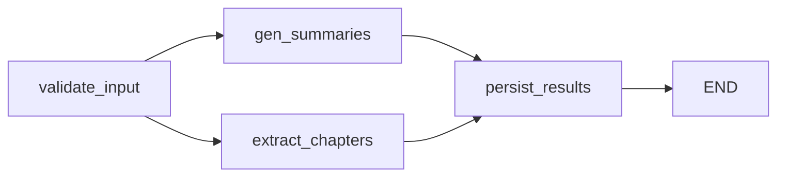

# VidSense UX Improvements Plan

## Current Architecture

The processing pipeline (LangGraph) runs `gen_summaries` and `extract_chapters` in parallel, then persists everything at once in `persist_results`. The frontend polls via HTMX every 3s and gets either a processing skeleton or the full results. No intermediate results are shown.




Current layout (kept, with improvements):

```
LEFT (scrollable)                    RIGHT (38%, sticky)
- Summaries (3 tabs, fixed-height)   - YouTube Player
- Chapters (timeline + cards)        - Title + duration + YT link
- Video Details (collapsible)        - Regenerate form
                                     - Keyboard shortcuts
```

---

## Change 1: Progressive Results (Chapter-by-Chapter)

### Problem

Long videos can take 3-5 minutes. The user sees only a skeleton loader until the entire pipeline finishes.

### Approach: Persist-as-you-go + enhanced polling

**Pipeline changes** in `[app/services/llm/nodes.py](app/services/llm/nodes.py)`:

- `gen_summaries_node`: after the LLM call succeeds, persist the 3 summaries to DB immediately (move persistence logic from `persist_results_node`)
- `extract_chapters_node`: for chunked extraction (long videos), persist each chunk's chapters to DB as soon as the chunk completes, rather than accumulating all and persisting at the end
- Rename `persist_results_node` to `finalize_run_node`: it only sets `run.status` and `run.completed_at` based on what was persisted. No more persistence logic here.
- Update `_set_step` to write more granular steps: `"generating_summaries"`, `"extracting_chapters"`, `"chapters_chunk_2_of_5"`, etc.

**Graph changes** in `[app/services/llm/graph.py](app/services/llm/graph.py)`: topology stays the same (parallel fan-out, fan-in to finalize). The nodes themselves now handle persistence.

**Polling endpoint changes** in `[app/routes/pages.py](app/routes/pages.py)`:

- When `run.status` is `processing`, query DB for any already-persisted summaries/chapters for this run
- If intermediate results exist, render a **progressive** version of the results (real data + skeleton placeholders for pending sections)
- If no results yet, render the existing processing skeleton

**Template changes** in `[app/templates/partials/processing.html](app/templates/partials/processing.html)`:

- When intermediate summaries or chapters are available, render them inline (reusing the same markup from `results.html`) alongside skeletons for the not-yet-ready sections
- Keep the stepper bar + elapsed timer at top
- Add a subtle "Still generating..." pulse indicator on skeleton sections

**Timing display**:

- During processing: elapsed timer already exists via `processingTimer()` Alpine component
- After completion: compute `completed_at - created_at` and display as "Processed in Xm Ys" in the results header
- The `AnalysisRun` model already has `created_at` and `completed_at` -- no schema change needed for timing

---

## Change 2: YouTube Metadata Display

### DB Schema Changes in `[app/models/db.py](app/models/db.py)`

Add columns to the `Video` model:

```python
channel_name: Mapped[str | None] = mapped_column(String(256))
channel_url: Mapped[str | None] = mapped_column(String(512))
description: Mapped[str | None] = mapped_column(Text)
upload_date: Mapped[str | None] = mapped_column(String(20))
view_count: Mapped[int | None] = mapped_column(Integer)
like_count: Mapped[int | None] = mapped_column(Integer)
```

### Ingestion Changes in `[app/services/youtube.py](app/services/youtube.py)`

In `ingest_video()`, populate the new fields from the yt-dlp metadata dict:

```python
video = Video(
    # ... existing fields ...
    channel_name=metadata.get("uploader") or metadata.get("channel"),
    channel_url=metadata.get("channel_url") or metadata.get("uploader_url"),
    description=metadata.get("description"),
    upload_date=metadata.get("upload_date"),  # "YYYYMMDD" format from yt-dlp
    view_count=metadata.get("view_count"),
    like_count=metadata.get("like_count"),
)
```

### DB Migration

Since this uses SQLite with `Base.metadata.create_all` at startup (which only creates new tables, not new columns on existing tables), add a lightweight startup migration helper in `[app/database.py](app/database.py)` that runs `ALTER TABLE videos ADD COLUMN ...` for each missing column, wrapped in try/except to handle the "column already exists" case gracefully. No Alembic dependency needed.

### UI Display

Add a collapsible "Video Details" section in the left panel (below chapters) showing:

- Channel name (linked to channel URL)
- Upload date (formatted nicely, e.g. "Mar 15, 2026")
- View count + like count (formatted with commas)
- Description (truncated to ~3 lines with "Show more" expand using Alpine `x-show`)
- URLs in description auto-linked as clickable references

This will be a new partial `[app/templates/partials/video_metadata.html](app/templates/partials/video_metadata.html)` included in `results.html` after the chapters section.

---

## Change 3: YouTube Link (View + Copy)

### In the right panel's video info bar (`[app/templates/video.html](app/templates/video.html)` lines 58-73)

Enhance the current info bar to include a "YouTube" link (opens in new tab) and a copy-to-clipboard button:

```html
<div class="px-4 pt-3 pb-2.5 border-b border-slate-100 shrink-0">
  <h1 class="font-semibold text-slate-900 text-sm leading-snug line-clamp-2">
    {{ video.title or 'Untitled Video' }}
  </h1>
  <div class="flex items-center gap-2 mt-1.5 text-xs text-slate-400 flex-wrap">
    <span>{{ duration }}</span>
    <span class="text-slate-300">&middot;</span>
    <a href="{{ video.url }}" target="_blank" rel="noopener"
       class="text-brand-600 hover:text-brand-700 hover:underline inline-flex items-center gap-1">
      <svg class="w-3 h-3"><!-- external-link icon --></svg>
      YouTube
    </a>
    <button @click="window.vsCopyToClipboard('{{ video.url }}', 'YouTube link')"
            title="Copy YouTube link"
            class="text-slate-400 hover:text-brand-600 transition-colors">
      <svg class="w-3.5 h-3.5"><!-- clipboard icon --></svg>
    </button>
  </div>
</div>
```

The `vsCopyToClipboard` helper already exists in `[static/js/app.js](static/js/app.js)`.

---

## Change 4: Fixed-Height Summary Section (Prevent Chapter Shifting)

### Problem

Currently, the summary content (Quick Take / Executive / Detailed Outline) sits above chapters in the left panel. Switching tabs changes the content height, causing chapters below to shift up/down.

### Solution

Wrap the summary content area in a fixed `max-height` container with `overflow-y: auto` and `resize: vertical`.

In `[app/templates/partials/results.html](app/templates/partials/results.html)`, around lines 112-179 (the summary content panes):

```html
<div class="summary-content-container overflow-y-auto resize-y"
     style="max-height: 28rem; min-height: 8rem;">
  <!-- Quick Take pane -->
  <div x-show="activeTab === 'thesis'" ...>...</div>
  <!-- Executive pane -->
  <div x-show="activeTab === 'executive'" ...>...</div>
  <!-- Detailed Outline pane -->
  <div x-show="activeTab === 'detailed'" ...>...</div>
</div>
```

- `max-height: 28rem` (~448px) provides generous space for the Detailed Outline (typically 10-20 bullet points) while keeping chapters visible without scrolling the entire page
- `resize: vertical` adds a native browser drag handle at the bottom-right corner of the summary box, letting the user manually adjust the height
- `min-height: 8rem` prevents collapsing to nothing
- `overflow-y: auto` shows a scrollbar only when content exceeds the max-height

Add supporting CSS in `[static/css/app.css](static/css/app.css)`:

```css
.summary-content-container {
  border-bottom: 1px solid theme('colors.slate.100');
  padding-bottom: 1rem;
  margin-bottom: 1.5rem;
}
```

### Why this works

- Chapters always start at the same vertical position regardless of which summary tab is active
- The Detailed Outline (longest content) fits comfortably in 28rem for typical videos
- User can drag to resize if they want more/less space
- No layout restructuring needed -- same left/right panel arrangement, same single HTMX polling target

---

## Change 5: Collapsible Chapter Cards with Expand/Collapse All

### Current Behavior

Each chapter card in `[app/templates/partials/chapter_card.html](app/templates/partials/chapter_card.html)` always shows:

- Header row: number, timestamp button, title, "Now Playing" badge, duration
- Summary paragraph (1-2 sentences)
- Key points bullet list (always visible)
- Transcript segment (expandable, collapsed by default)

For videos with many chapters, the page is very long and hard to scan.

### New Behavior

**Collapsed state** (default): compact row showing only:

- Chapter number + timestamp button + title + duration
- One-line summary text (truncated if needed)

**Expanded state**: everything currently shown (summary, key points, transcript toggle).

**Expand All / Collapse All** controls at the chapter section header.

### Implementation

**Parent-level Alpine state** in `[app/templates/partials/results.html](app/templates/partials/results.html)`, on the `#chapters-section` div:

```html
<div id="chapters-section" x-data="{ allExpanded: false }">
  <div class="flex items-center justify-between mb-3">
    <h2 class="text-xl font-bold text-slate-900">
      Chapters <span class="ml-2 text-sm font-normal text-slate-400">({{ chapters|length }})</span>
    </h2>
    <button @click="allExpanded = !allExpanded"
            class="text-xs text-slate-400 hover:text-brand-600 transition-colors">
      <span x-text="allExpanded ? 'Collapse all' : 'Expand all'"></span>
    </button>
  </div>
  <!-- timeline + chapter cards -->
</div>
```

**Per-card state** in `[app/templates/partials/chapter_card.html](app/templates/partials/chapter_card.html)`:

Change the existing `x-data="{ expanded: false }"` to react to the parent's `allExpanded`:

```html
<div class="chapter-card ..."
     x-data="{ localExpanded: false, expanded: false }"
     x-effect="expanded = allExpanded || localExpanded"
     ...>
```

- `allExpanded` comes from the parent scope (Alpine scoping propagates down)
- `localExpanded` tracks per-card toggle (clicking a card toggles just that card)
- `expanded` is the computed state: true if either the global toggle or the local toggle is on

**Card header becomes clickable** to toggle `localExpanded`:

```html
<div class="flex items-start gap-3 p-4 cursor-pointer select-none"
     @click="localExpanded = !localExpanded">
  <!-- number, timestamp, title, duration (always visible) -->
  <!-- chevron icon that rotates when expanded -->
</div>
```

**Collapsible body** wraps key points + transcript:

```html
<div x-show="expanded" x-collapse>
  <!-- summary paragraph (full, not truncated) -->
  <!-- key points list -->
  <!-- transcript toggle -->
</div>
```

The **summary line** in collapsed state shows a truncated one-liner via `line-clamp-1`, and in expanded state shows the full text. This can be done with:

```html
<p class="text-slate-500 text-xs mt-1 leading-relaxed"
   :class="expanded ? '' : 'line-clamp-1'">
  {{ chapter.summary }}
</p>
```

The summary stays visible in both states (just truncated vs full), while key points and transcript are hidden when collapsed.

### Alpine `x-collapse` Plugin

For smooth height animation, use Alpine's `x-collapse` plugin (already available via CDN). This animates the height transition instead of the abrupt `x-show` toggle. If not already included, add to `[app/templates/base.html](app/templates/base.html)`:

```html
<script defer src="https://cdn.jsdelivr.net/npm/@alpinejs/collapse@3.x.x/dist/cdn.min.js"></script>
```

This must be loaded **before** the main Alpine script.

### Files Changed

- `[app/templates/partials/results.html](app/templates/partials/results.html)`: Add `x-data` with `allExpanded` to chapters section; add Expand/Collapse All button
- `[app/templates/partials/chapter_card.html](app/templates/partials/chapter_card.html)`: Restructure to make header clickable, wrap key points + transcript in collapsible body, add chevron indicator
- `[app/templates/base.html](app/templates/base.html)`: Add Alpine Collapse plugin CDN (if not already present)
- `[static/css/app.css](static/css/app.css)`: Transition styles for collapse animation, cursor pointer on card header

---

## File Change Summary


| File                                              | Changes                                                                                                   |
| ------------------------------------------------- | --------------------------------------------------------------------------------------------------------- |
| `app/models/db.py`                                | Add 6 metadata columns to Video model                                                                     |
| `app/database.py`                                 | Add startup migration helper for new Video columns                                                        |
| `app/services/youtube.py`                         | Populate new metadata fields from yt-dlp                                                                  |
| `app/services/llm/nodes.py`                       | Persist summaries/chapters in their own nodes; rename persist_results to finalize_run                     |
| `app/services/llm/graph.py`                       | Update node name reference                                                                                |
| `app/routes/pages.py`                             | Return intermediate results during processing; pass timing data to results template                       |
| `app/templates/video.html`                        | Add YouTube link + copy button to info bar                                                                |
| `app/templates/base.html`                         | Add Alpine Collapse plugin CDN                                                                            |
| `app/templates/partials/results.html`             | Fixed-height summary container; processing time; video metadata include; Expand/Collapse All for chapters |
| `app/templates/partials/chapter_card.html`        | Collapsible cards: clickable header, hidden key points + transcript when collapsed, chevron indicator     |
| `app/templates/partials/processing.html`          | Support progressive state (show available results + skeletons for pending sections)                       |
| `static/css/app.css`                              | Styles for summary container, resize handle, metadata section, collapse animations                        |
| New: `app/templates/partials/video_metadata.html` | Collapsible YouTube metadata display                                                                      |


