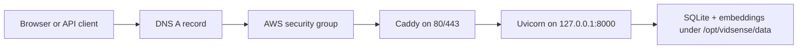

# AWS VM deployment (EC2)

This document covers deploying VidSense to a single EC2 instance.
Read the provider-agnostic checklist in [deployment.md](deployment.md) alongside this file.
Templates referenced here live in [deploy/](../deploy/).

---

## Request flow



The public internet only reaches Caddy. FastAPI stays localhost-only inside the VM, and Caddy forwards requests to it after TLS termination and Basic Auth.

---

## 1. Pick an EC2 instance

**AMI:** Ubuntu Server 24.04 LTS (or the latest LTS available). Search for
`ubuntu/images/hvm-ssd-gp3/ubuntu-noble-24.04-amd64-server-*` in the AMI
catalog, filter by **64-bit (x86)**, pick the most recent AWS-published image.

**Instance type recommendations:**

| Workload | Type | vCPU | RAM |
|----------|------|------|-----|
| Light / experimentation | `t3.small` | 2 | 2 GB |
| Normal use (recommended start) | `t3.medium` | 2 | 4 GB |
| Heavy LLM workloads | `t3.large` | 2 | 8 GB |

Start with `t3.medium`. LangGraph pipelines are I/O-bound (waiting on LLM
providers), so RAM matters more than CPU here.

**Storage:** 20 GB `gp3` root volume is comfortable for code, venv, and a
moderate SQLite + FAISS data directory. Add more if you expect large embedding
indexes.

**Region:** Pick the AWS region closest to your users (e.g. `us-east-1`,
`eu-west-1`). The Elastic IP must be allocated in the same region as the
instance. Your DNS provider / hosted zone is separate from that.

---

## 2. Launch the instance (AWS console)

1. Open **EC2 → Launch Instance**.
2. Name: `vidsense-prod` (or similar).
3. AMI: Ubuntu 24.04 LTS as above.
4. Instance type: `t3.medium`.
5. **Key pair:** Create a new key pair → type RSA → `.pem` format.  
   Download and move it somewhere safe:
   ```bash
   mv ~/Downloads/vidsense-prod.pem ~/.ssh/
   chmod 400 ~/.ssh/vidsense-prod.pem
   ```
6. **Network settings (create a new security group):**  
   See full rules in [§ Security group](#3-security-group) below.
7. Storage: 20 GiB `gp3`.
8. Launch.

---

## 3. Security group

Create (or edit) the security group attached to the instance with these
**inbound** rules:

| Type | Protocol | Port | Source | Purpose |
|------|----------|------|--------|---------|
| SSH | TCP | 22 | **Your IP** (My IP) | Admin access only |
| HTTP | TCP | 80 | `0.0.0.0/0`, `::/0` | Let's Encrypt ACME challenge |
| HTTPS | TCP | 443 | `0.0.0.0/0`, `::/0` | Public traffic |

**Port 8000 must have no inbound rule** — Uvicorn binds to `127.0.0.1` and
is only reachable via Caddy on the same machine.

**Outbound:** keep the default "all traffic" rule so the instance can pull
packages, reach LLM APIs, and contact Let's Encrypt.

---

## 4. Elastic IP (stable public address)

An EC2 instance's public IP changes when it stops. Attach an Elastic IP so
your DNS record stays valid:

1. EC2 → **Elastic IPs** → Allocate.
2. Select the new allocation → **Associate** → choose your instance.
3. Note the address — this is the value you point your DNS A record at.

> Skip this step if you are only experimenting and do not need a persistent
> domain. You can always add it later.

---

## 5. DNS

Point your domain (or subdomain) at the Elastic IP. Example using Route 53:

1. Route 53 → **Hosted zones** → select your domain.
2. **Create record** → A record → name: `vidsense` (or `@` for apex) →
   value: `<Elastic IP>` → TTL: 300 → **Create**.

If using an external registrar, create the A record there. Caddy requires
the domain to resolve to the instance **before** it can obtain a TLS
certificate via Let's Encrypt.

---

## 6. SSH to the instance

```bash
ssh -i ~/.ssh/vidsense-prod.pem ubuntu@<Elastic-IP>
```

Verify connectivity, then proceed with the bootstrap script.

---

## 7. Bootstrap the VM

`deploy/bootstrap.sh` automates the runtime stack installation and service
setup. It is designed to be **idempotent** — safe to re-run.

Copy the script to the instance and run it as root (or with sudo):

```bash
# From your local machine
scp -i ~/.ssh/vidsense-prod.pem deploy/bootstrap.sh ubuntu@<Elastic-IP>:/tmp/

# On the instance
chmod +x /tmp/bootstrap.sh
sudo /tmp/bootstrap.sh
```

If you are deploying from a fork or private clone URL, pass it explicitly:

```bash
sudo /tmp/bootstrap.sh --repo https://github.com/your-org/vidsense.git --branch main
```

The script:
- Updates apt packages and installs git
- Installs [uv](https://docs.astral.sh/uv/)
- Installs Caddy from the official Caddy apt repository
- Creates a `vidsense` system user
- Clones the repo to `/opt/vidsense` (or pulls if already present)
- Runs `uv python install` using the version in [`.python-version`](../.python-version) (downloads a matching CPython; Ubuntu’s system `python3.12` is often **too old** for `requires-python` in `pyproject.toml`)
- Creates the virtual environment and installs dependencies via `uv sync`
- Installs the systemd unit from `deploy/vidsense.service`
- Enables and starts Caddy so the final config reload works predictably

---

## 8. Configure secrets and environment

After the bootstrap completes, create the production `.env` on the instance:

```bash
sudo -u vidsense bash -c '
  cp /opt/vidsense/.env.example /opt/vidsense/.env
  chmod 600 /opt/vidsense/.env
'
sudo -u vidsense nano /opt/vidsense/.env
```

Minimum required changes from the example:

```ini
APP_DEBUG=false
# Generate: python3 -c "import secrets; print(secrets.token_urlsafe(32))"
APP_SECRET_KEY=<generated-value>
APP_ALLOWED_HOSTS=vidsense.info,localhost,127.0.0.1
# ^ Must include the real domain or requests get 400 Bad Request with no body.

# YouTube Data API v3 (required — enable API in Google Cloud, create key)
YOUTUBE_API_KEY=...

# Set your provider
LLM_PROVIDER=openai
OPENAI_API_KEY=sk-...
```

**Do not** paste secrets in the shell where history is recorded. Use `nano`
or `vi` directly. After editing, verify permissions:

```bash
ls -la /opt/vidsense/.env   # should show -rw------- vidsense vidsense
```

---

## 9. Start the application service

```bash
sudo systemctl start vidsense
sudo systemctl status vidsense
sudo journalctl -u vidsense -f          # follow logs (systemd captures stdout/stderr)
```

**Logging:** The application does not create a log file on disk by default; it logs to stderr, and the sample systemd unit sends that to the journal (see [Logging](deployment.md#logging) in `deployment.md`). Use `journalctl -u vidsense` for production logs.

**Running uvicorn manually on the VM** (for example while debugging), capture output to a file with the same redirects:

```bash
cd /opt/vidsense
sudo -u vidsense /opt/vidsense/.venv/bin/uvicorn main:app --host 127.0.0.1 --port 8000 2>&1 | tee -a app.log
# Or stderr only:  ... 2>app.log
# Or both streams to one file:  ... >app.log 2>&1
```

The app should start and bind to `127.0.0.1:8000`. If it fails, the most
common causes are:
- `APP_SECRET_KEY` still set to the default placeholder
- Missing or invalid `YOUTUBE_API_KEY` (the app validates it at startup)
- Missing or wrong `OPENAI_API_KEY` / other provider key
- Python import error (check `journalctl`)

---

## 10. Configure Caddy

Edit the Caddyfile for your domain:

```bash
sudo cp /opt/vidsense/deploy/Caddyfile /etc/caddy/Caddyfile
sudo nano /etc/caddy/Caddyfile
```

Replace `YOUR_DOMAIN` with your actual domain (e.g. `vidsense.info`)
and add a `basicauth` entry. Generate the bcrypt hash:

```bash
caddy hash-password --plaintext 'YourChosenPassword'
```

Paste the hash into the Caddyfile:

```caddyfile
vidsense.info {
    basicauth {
        admin $2a$14$<hash-output-here>
    }
    ...
}
```

Then reload Caddy:

```bash
sudo systemctl status caddy
sudo systemctl reload caddy
sudo journalctl -u caddy -f             # watch for TLS cert issuance
```

Caddy will automatically obtain a Let's Encrypt certificate for the domain
(requires DNS to resolve and port 80/443 open). Certificate issuance usually
completes within 30 seconds.

The sample Caddyfile already includes:
- Basic Auth in front of the whole site
- Security headers plus a basic CSP
- A 10 MB request-body limit
- Upstream dial/header timeouts

Stock Caddy does not ship built-in rate limiting, so that part is intentionally deferred for this v1 VM setup.

---

## 11. Smoke test

```bash
# From your local machine — should redirect to HTTPS and prompt for auth
curl -I http://vidsense.info

# Confirm the app is up and responding
curl -u admin:YourChosenPassword https://vidsense.info

# Confirm port 8000 is NOT reachable from the internet
curl --max-time 5 http://<Elastic-IP>:8000   # should time out or refuse
```

Open `https://vidsense.info` in a browser, authenticate, and exercise
the main flow (paste a YouTube URL and run an analysis).

---

## 12. Backups

SQLite and FAISS indexes live in `/opt/vidsense/data/`. Back them up regularly.

**Simple scripted backup to S3 (example):**

```bash
# Install awscli if not present
sudo apt install -y awscli

# Create an IAM user with s3:PutObject on your bucket, add credentials:
aws configure   # or use an instance profile (preferred)

# Add to crontab (daily at 03:00)
0 3 * * * tar czf /tmp/vidsense-data-$(date +\%F).tar.gz -C /opt/vidsense data && \
          aws s3 cp /tmp/vidsense-data-$(date +\%F).tar.gz s3://your-bucket/backups/ && \
          rm /tmp/vidsense-data-$(date +\%F).tar.gz
```

**EBS snapshot (alternative / complement):**  
EC2 → Volumes → select root volume → **Create snapshot**. Automate with
**AWS Backup** or a Lambda on a schedule.

---

## 13. Updates and redeployment

```bash
# SSH to the instance
cd /opt/vidsense
sudo -u vidsense git pull
sudo -u vidsense /opt/vidsense/.venv/bin/uv sync
sudo systemctl restart vidsense
sudo journalctl -u vidsense -f          # follow logs after restart
```

If you need a file copy of logs after a restart, use `journalctl` redirection instead of relying on the app:

```bash
sudo journalctl -u vidsense --since "1 hour ago" > /tmp/vidsense-journal.log
```

---

## Related

- Provider-agnostic checklist: [deployment.md](deployment.md)
- Caddyfile template: [deploy/Caddyfile](../deploy/Caddyfile)
- systemd unit template: [deploy/vidsense.service](../deploy/vidsense.service)
- Bootstrap script: [deploy/bootstrap.sh](../deploy/bootstrap.sh)
- Environment template: [.env.example](../.env.example)
